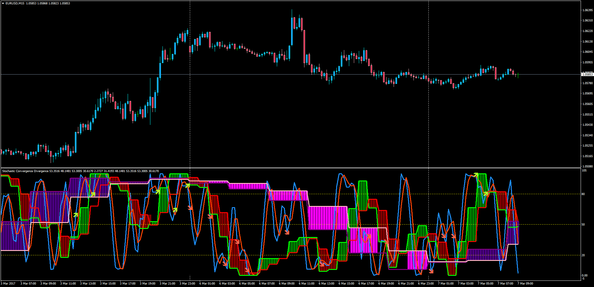

# 3_in_1_Stochastic

> Source: https://fxcodebase.com/code/viewtopic.php?f=38&t=64506  
> Forum: 38 · Topic 64506 · 1 post(s)

---

## 3_in_1_Stochastic

**Apprentice** · Tue Mar 07, 2017 4:49 am

Description:
3 in 1 MTF Stochastic with MA Smoothing options and analysis between the 3 to determine valid MA cross signals.

 [3_in_1_Stochastic.mq4](files/111358/3_in_1_Stochastic.mq4)

TS2/Marketscope version.
[viewtopic.php?f=17&t=63215&p=105428#p105428](https://fxcodebase.com/code/viewtopic.php?f=17&t=63215&p=105428#p105428)
