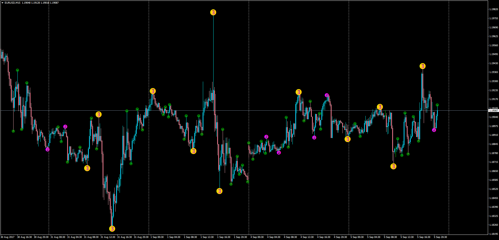

# 3 Level ZigZag Semafor

> Source: https://fxcodebase.com/code/viewtopic.php?f=38&t=65061  
> Forum: 38 · Topic 65061 · 1 post(s)

---

## 3 Level ZigZag Semafor

**Apprentice** · Wed Sep 06, 2017 3:35 am

3 Level ZigZag Semafor

LUA Original: [viewtopic.php?f=17&t=954](https://fxcodebase.com/code/viewtopic.php?f=17&t=954)

Description:

This is the MT4 version of the LUA original 3 Level ZigZag Semafor. The indicator is described in The Folding Rule by Viktor Likhovidov article in Stock & Commodities in June, 2001 issue.

 [Semaphor_3Level_ZZ.mq4](files/114722/Semaphor_3Level_ZZ.mq4)
