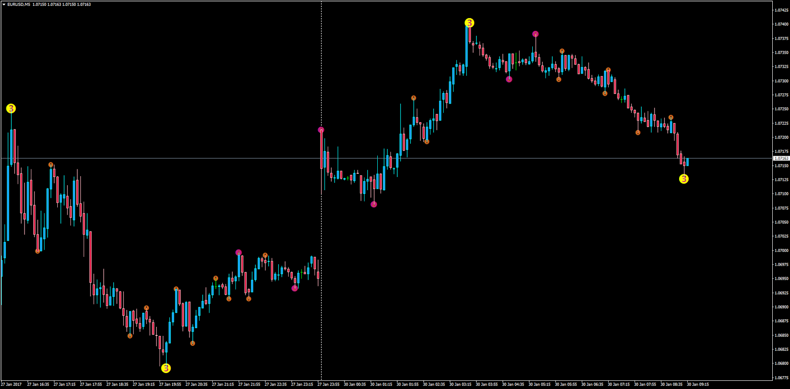
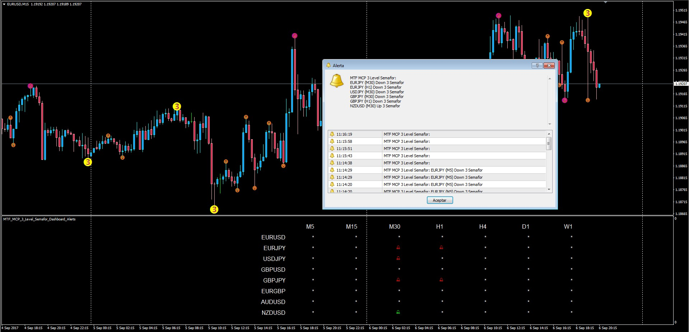
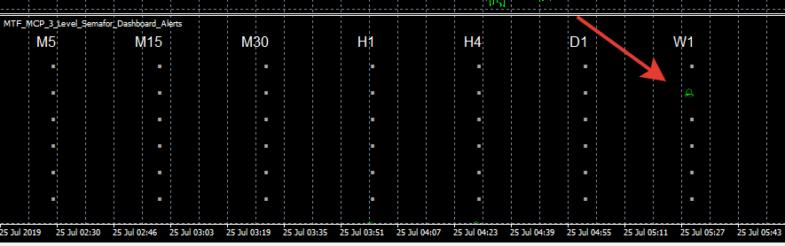

# 3 Level ZZ Semafor Alert

> Source: https://fxcodebase.com/code/viewtopic.php?f=38&t=64369  
> Forum: 38 · Topic 64369 · 11 post(s)

---

## 3 Level ZZ Semafor Alert

**Apprentice** · Mon Jan 30, 2017 4:50 am

3 Level ZZ Semafor Alert
Description:

This indicator will provide Sound and Email Alerts whenever a "3" signal is originated by the semafor indicator.

The trader can choose the current timeframe or a higher TF, this means that multiple instances can be added to be alerted from multiple TF's getting the condition.

Note: For it to work it is needed to have the "3_Level_ZZ_Semafor.mq4" indicator installed in the same folder. It can be found here:
 [viewtopic.php?f=38&t=65061&p=114722&hilit=+3_Level_ZZ_Semafor.mq4#p114722](https://fxcodebase.com/code/viewtopic.php?f=38&t=65061&p=114722&hilit=+3_Level_ZZ_Semafor.mq4#p114722)

 [3_Level_ZZ_Semafor_Alert.mq4](files/110795/3_Level_ZZ_Semafor_Alert.mq4)

---

## Re: 3 Level ZZ Semafor Alert

**pippimp** · Tue Apr 18, 2017 9:24 am

Thank you for this indicator. It it possible for you to create a dashboard across several pairs (definitely all majors) to track when a 3 is signaled on any pair?

User can designate which timeframe for each pair.

Thank you again!

Theo

---

## Re: 3 Level ZZ Semafor Alert

**Apprentice** · Tue Apr 18, 2017 12:11 pm

Your request is added to the development list, Under Id Number 3783
 If someone is interested to do this task, please contact me.

---

## Re: 3 Level ZZ Semafor Alert

**Apprentice** · Wed Sep 06, 2017 5:00 pm

Description:

This dashboard will show exactly in which pairs and time frames a Semafor Number 3 is showing up and will optionally produce a sound alert when it happens.

Note: it requieres the Semaphor_3Level_ZZ.mq4 to be installed in the same indicators folder, which can be obtained here: [viewtopic.php?f=38&t=65061](https://fxcodebase.com/code/viewtopic.php?f=38&t=65061)

 [MTF_MCP_3_Level_Semafor_Dashboard_Alerts.mq4](files/114750/MTF_MCP_3_Level_Semafor_Dashboard_Alerts.mq4)

---

## Re: 3 Level ZZ Semafor Alert

**Apprentice** · Mon Jul 08, 2019 6:44 am

Based on request.
[viewtopic.php?f=27&t=68626](https://fxcodebase.com/code/viewtopic.php?f=27&t=68626)

 [MTF_MCP_3_Level_Semafor_Dashboard_Alerts.mq4](files/127271/MTF_MCP_3_Level_Semafor_Dashboard_Alerts.mq4)

Note: it requieres the Semaphor_3Level_ZZ.mq4 to be installed in the same indicators folder, which can be obtained here: [viewtopic.php?f=38&t=65061](https://fxcodebase.com/code/viewtopic.php?f=38&t=65061)

---

## Re: 3 Level ZZ Semafor Alert

**Chatagny** · Tue Jul 23, 2019 8:08 am

Hello the dashboard doesn't work on my MT4. I can add it on a chart. It appear but doesn't provide me any signal. Who knows why? What can I do to make it works?
Thank's

---

## Re: 3 Level ZZ Semafor Alert

**Apprentice** · Tue Jul 23, 2019 3:32 pm

It requires the Semaphor_3Level_ZZ.mq4 to be installed in the same indicators folder, which can be obtained here: [viewtopic.php?f=38&t=65061](https://fxcodebase.com/code/viewtopic.php?f=38&t=65061)

---

## Re: 3 Level ZZ Semafor Alert

**Chatagny** · Tue Jul 23, 2019 3:58 pm

> **Apprentice wrote:**
> It requires the Semaphor_3Level_ZZ.mq4 to be installed in the same indicators folder, which can be obtained here: [http://fxcodebase.com/code/viewtopic.php?f=38&t=65061](https://fxcodebase.com/code/viewtopic.php?f=38&t=65061)

Hello thank's for the reply. Yes I know, I put that indicator in the same folder. It still doesn' work...

---

## Re: 3 Level ZZ Semafor Alert

**Apprentice** · Wed Jul 24, 2019 7:15 am

[viewtopic.php?f=38&t=64381](https://fxcodebase.com/code/viewtopic.php?f=38&t=64381)

---

## Re: 3 Level ZZ Semafor Alert

**Chatagny** · Wed Jul 24, 2019 9:07 am

Ok Thank you. That's exactly what I did. The dashboard still don't work.

---

## Re: 3 Level ZZ Semafor Alert

**Apprentice** · Thu Jul 25, 2019 1:40 am

I have no issues with it. Maybe this indicator doesn't have any signals with your parameters?
