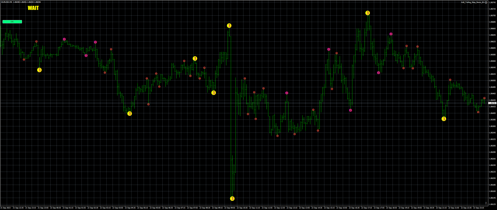

# 3_Level_ZZ_Semafor_TRO_MODIFIED_VERSION_Btn

> Source: https://fxcodebase.com/code/viewtopic.php?f=38&t=74306  
> Forum: 38 · Topic 74306 · 4 post(s)

---

## 3_Level_ZZ_Semafor_TRO_MODIFIED_VERSION_Btn

**Apprentice** · Wed Nov 01, 2023 3:16 pm

Based on the request.
[https://fxcodebase.com/code/viewtopic.php?f=27&p=152978](https://fxcodebase.com/code/viewtopic.php?f=27&p=152978)

 [3_Level_ZZ_Semafor_TRO_MODIFIED_VERSION_Btn.mq4](files/153136/3_Level_ZZ_Semafor_TRO_MODIFIED_VERSION_Btn.mq4)

---

## Re: 3_Level_ZZ_Semafor_TRO_MODIFIED_VERSION_Btn

**ACast2022** · Wed Jul 17, 2024 2:50 pm

I know that you have a lot of work, but if you could do an MT5 version it would be great. Thanks in advance.

---

## Re: 3_Level_ZZ_Semafor_TRO_MODIFIED_VERSION_Btn

**Apprentice** · Thu Jul 18, 2024 3:25 pm

We have added your request to the development list.
Development reference 583

---

## Re: 3_Level_ZZ_Semafor_TRO_MODIFIED_VERSION_Btn

**Apprentice** · Fri Dec 12, 2025 4:01 am

[3_Level_ZZ_Semafor_TRO_MODIFIED_VERSION_Btn.mq5](files/161382/3_Level_ZZ_Semafor_TRO_MODIFIED_VERSION_Btn.mq5)
