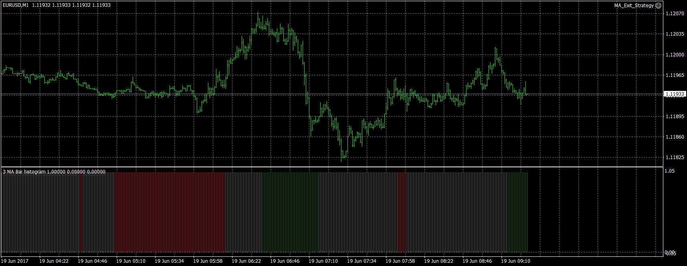

# 3 MA Bar histogram

> Source: https://fxcodebase.com/code/viewtopic.php?f=38&t=65084  
> Forum: 38 · Topic 65084 · 5 post(s)

---

## 3 MA Bar histogram

**Apprentice** · Wed Sep 13, 2017 5:19 am

Based on TS2 / lua source.
[viewtopic.php?f=17&t=9634](https://fxcodebase.com/code/viewtopic.php?f=17&t=9634)

ma1 > ma 2 > ma3 > ma4 > ma5 -------- green color
ma1 < ma2 < ma 3 < ma 4 < ma 5---------red color

 [3 MA Bar histogram.MQ4](files/114855/3%20MA%20Bar%20histogram.MQ4)

---

## Re: 3 MA Bar histogram

**spinemaligna** · Tue Mar 02, 2021 4:32 am

Hi there,

In an attempt to clean up my charts I applied this histogram to lose three mas from my screen. However it appears not to plot neutral areas when the mas are crossing. So when MA1 crosses below MA2 but remains above MA3 it plots a red bar instead of a grey one and vice versa.
If I have got it right then the following should be the result:
MA1>MA2>MA3=Green Bar
MA3>MA2>MA1=Red Bar
Any other combination=Grey Bar.
At no time do I see a grey bar.
Can this be fixed?

Thanks

Ross

---

## Re: 3 MA Bar histogram

**Apprentice** · Tue Mar 02, 2021 5:08 am

Your request is added to the development list.
Development reference 240.

---

## Re: 3 MA Bar histogram

**Apprentice** · Thu Mar 04, 2021 12:59 pm

I don't have any issues. It paint gray as well

---

## Re: 3 MA Bar histogram

**spinemaligna** · Fri Mar 05, 2021 4:16 am

Having played with it I was asking it just to look at three MAs,9,13,21 EMA. If I populate all five slots with 9,10,13,14,21,22 it does show grey bars. Will have to test to see what difference that makes or can it be modidied to work with just three inputs or indeed is there an indicator that does that.
Many thanks for your hard work.

Ross
