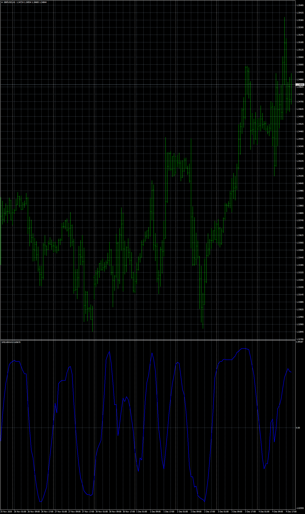

# 3 oscillator arrows

> Source: https://fxcodebase.com/code/viewtopic.php?f=38&t=70684  
> Forum: 38 · Topic 70684 · 1 post(s)

---

## 3 oscillator arrows

**Apprentice** · Fri Dec 04, 2020 1:42 pm

TS2 Lua version.
[viewtopic.php?f=17&t=70677](https://fxcodebase.com/code/viewtopic.php?f=17&t=70677)

 [3 oscillator arrows.mq4](files/139313/3%20oscillator%20arrows.mq4)

Demand_Index
[viewtopic.php?f=38&t=61625](https://fxcodebase.com/code/viewtopic.php?f=38&t=61625)

Spearman_Rank_Correlation
[viewtopic.php?f=38&t=61638](https://fxcodebase.com/code/viewtopic.php?f=38&t=61638)
