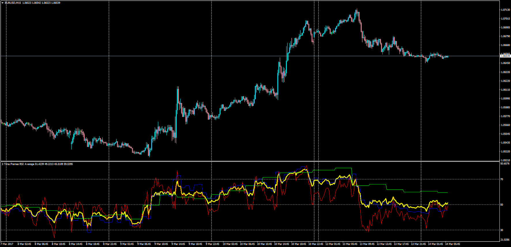

# 3 Time Frames RSI Average

> Source: https://fxcodebase.com/code/viewtopic.php?f=38&t=64522  
> Forum: 38 · Topic 64522 · 1 post(s)

---

## 3 Time Frames RSI Average

**Apprentice** · Tue Mar 14, 2017 5:47 am

LUA Original: [viewtopic.php?f=17&t=4635](https://fxcodebase.com/code/viewtopic.php?f=17&t=4635)

Description:
This indicator will create an average RSI from 3 different time frame's RSIs.
The source TF's RSI can be displayed or not.

 [3TF_RSI_Average.mq4](files/111444/3TF_RSI_Average.mq4)
