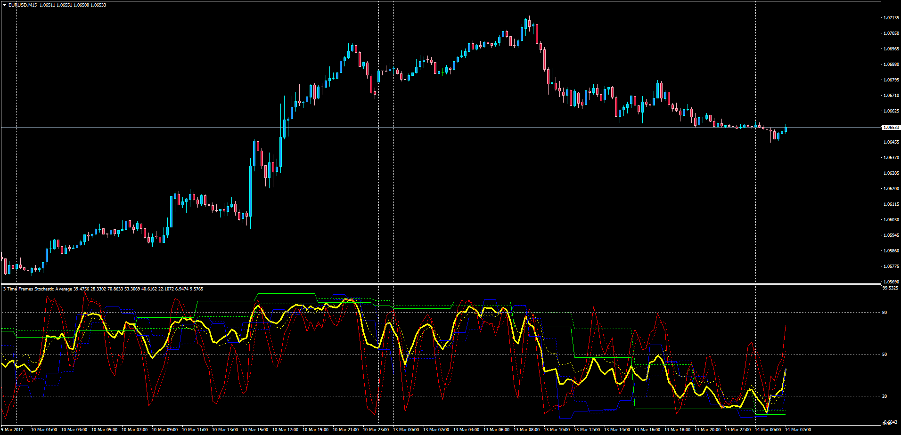

# 3 Time Frames Stochastic Average

> Source: https://fxcodebase.com/code/viewtopic.php?f=38&t=64523  
> Forum: 38 · Topic 64523 · 1 post(s)

---

## 3 Time Frames Stochastic Average

**Apprentice** · Tue Mar 14, 2017 5:49 am

LUA Original: [viewtopic.php?f=17&t=4124](https://fxcodebase.com/code/viewtopic.php?f=17&t=4124)
Description:
This indicator will create an average stochastic with its signal line from 3 different time frame's stochastics.
The source TF's stochastics can be displayed or not.

 [3TF_Stochastic_Average.mq4](files/111445/3TF_Stochastic_Average.mq4)
