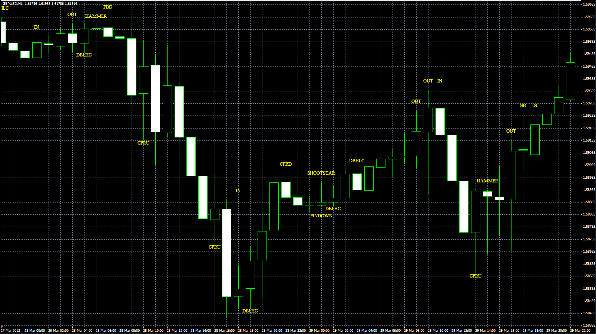

# 31 popular candle patterns

> Source: https://fxcodebase.com/code/viewtopic.php?f=38&t=17243  
> Forum: 38 · Topic 17243 · 10 post(s)

---

## 31 popular candle patterns

**Alexander.Gettinger** · Fri Apr 27, 2012 12:25 pm

Original indicator and pattern description: [viewtopic.php?f=17&t=903](https://fxcodebase.com/code/viewtopic.php?f=17&t=903)

 

Download:

 [Patterns.mq4](files/31578/Patterns.mq4)

---

## Re: 31 popular candle patterns

**[email protected]** · Mon Jul 02, 2012 1:39 am

Request the development of automated trading strategies .

---

## Re: 31 popular candle patterns

**Apprentice** · Mon Jul 02, 2012 3:18 am

This strategy is for MT4?

---

## Re: 31 popular candle patterns

**[email protected]** · Mon Jul 02, 2012 10:45 am

What I want is a self- reactive trading strategies executable trading

---

## Re: 31 popular candle patterns

**Apprentice** · Tue Jul 03, 2012 1:21 am

Can you specify for which platform.

---

## Re: 31 popular candle patterns

**[email protected]** · Tue Jul 03, 2012 12:23 pm

mp4

---

## Re: 31 popular candle patterns

**Alexander.Gettinger** · Thu Jul 12, 2012 2:48 pm

Expert advisor based on this indicator: [viewtopic.php?f=38&t=21012](https://fxcodebase.com/code/viewtopic.php?f=38&t=21012).

---

## Re: 31 popular candle patterns

**swizzz** · Sat Feb 02, 2013 12:08 pm

I've got problem with this indicator.Can someone help me?

---

## Re: 31 popular candle patterns

**Alexander.Gettinger** · Tue Feb 05, 2013 6:47 pm

> **swizzz wrote:**
> I've got problem with this indicator.Can someone help me?

Remove indicator from chart and add it again.

---

## Re: 31 popular candle patterns

**swizzz** · Thu Feb 07, 2013 12:51 pm

It doesn't help.Still the same on every timerfame
