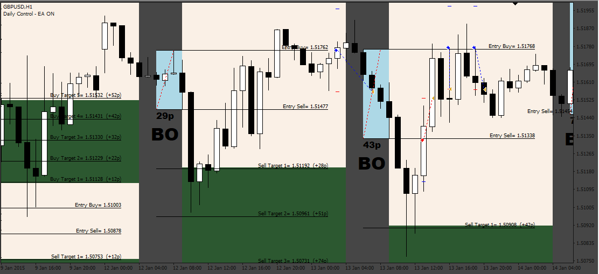
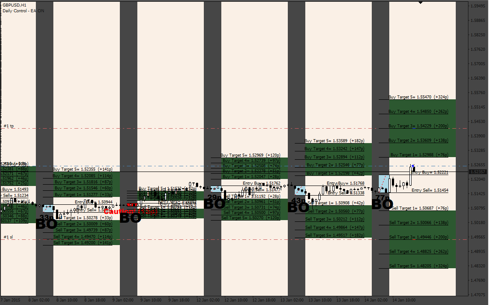

# 373_3_Tier_London_Breackout_EA

> Source: https://fxcodebase.com/code/viewtopic.php?f=38&t=73663  
> Forum: 38 · Topic 73663 · 4 post(s)

---

## 373_3_Tier_London_Breackout_EA

**Apprentice** · Mon May 01, 2023 3:56 am

Based on the request.
[https://fxcodebase.com/code/viewtopic.php?f=38&t=73645](https://fxcodebase.com/code/viewtopic.php?f=38&t=73645)

 [3_Tier_London_Breakout_V.3.2b.mq4](files/150634/3_Tier_London_Breakout_V.3.2b.mq4)

 [373_3_Tier_London_Breackout_EA.mq4](files/150634/373_3_Tier_London_Breackout_EA.mq4)

---

## Re: 373_3_Tier_London_Breackout_EA

**Apprentice** · Sat May 27, 2023 3:51 am

 [Tier_London_Breackout_EA_v3.mq4](files/151030/Tier_London_Breackout_EA_v3.mq4)

---

## Re: 373_3_Tier_London_Breackout_EA

**D-JONES** · Fri Nov 03, 2023 4:18 am

> **Apprentice wrote:**
>
>
> 478pic.png
>
>
>
>
> Tier_London_Breackout_EA_v3.mq4

Bug fix please
1-Martingale does not work properly
2- It doesn't exactly put pending on Entry numbers
3-Change the martingale method to additional,
for example if 1 lot was imported the first time, the second and third times, etc., should only be twice the size of the previous 2 lots, not more.

---

## Re: 373_3_Tier_London_Breackout_EA

**Apprentice** · Sat Nov 04, 2023 10:35 am

We have added your request to the development list.
Development reference 980
