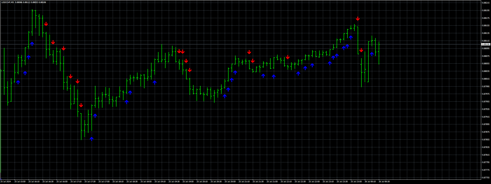

# 3bars_HL

> Source: https://fxcodebase.com/code/viewtopic.php?f=38&t=75096  
> Forum: 38 · Topic 75096 · 4 post(s)

---

## 3bars_HL

**Apprentice** · Sun Jul 28, 2024 2:03 am

Based on the request.
[https://fxcodebase.com/code/viewtopic.php?f=38&t=74707](https://fxcodebase.com/code/viewtopic.php?f=38&t=74707)

 [3bars_HL.mq4](files/156248/3bars_HL.mq4)

---

## Re: 3bars_HL

**Teruyoshi** · Thu Aug 01, 2024 3:09 am

Thanks for great indicator.
 It woudl be of great value to everybody to add on off button (toggle) function to this guy.
So many thanks in advance.

---

## Re: 3bars_HL

**Apprentice** · Mon Aug 05, 2024 4:21 am

We have added your request to the development list.
Development reference 634

---

## Re: 3bars_HL

**Apprentice** · Sat Aug 10, 2024 7:25 pm

Try this version.

 [3bars_HL_v1.10.mq4](files/156382/3bars_HL_v1.10.mq4)
