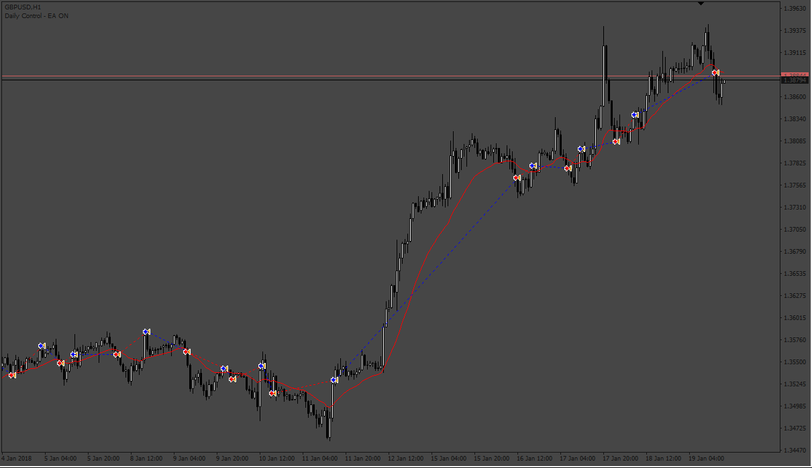
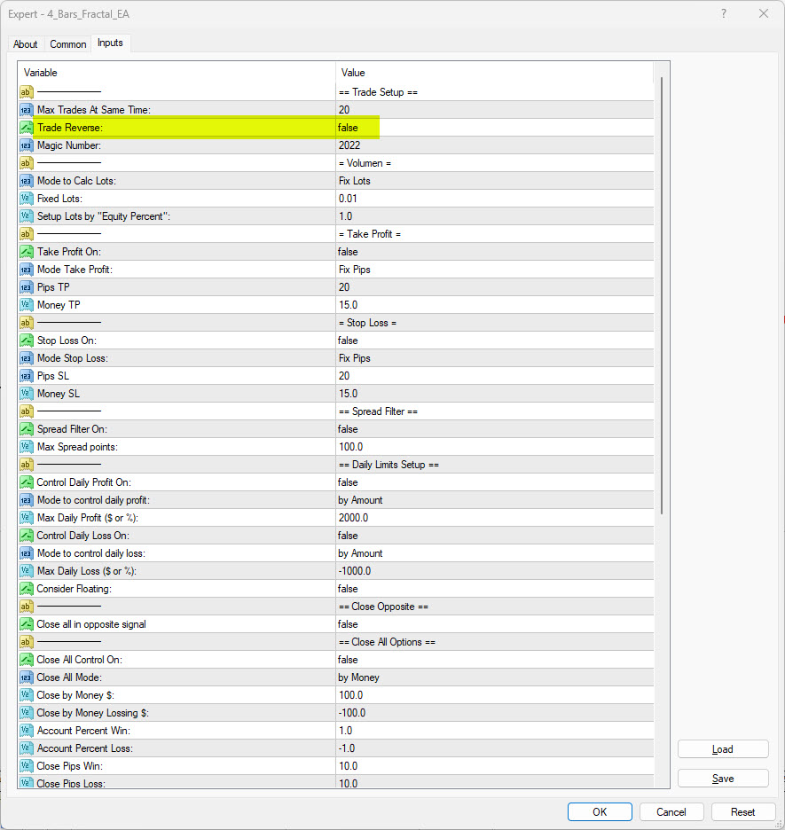

# 4_Bars_Fractal_EA

> Source: https://fxcodebase.com/code/viewtopic.php?f=38&t=73846  
> Forum: 38 · Topic 73846 · 3 post(s)

---

## 4_Bars_Fractal_EA

**Apprentice** · Tue Jun 20, 2023 12:26 pm

Based on the request.
[https://fxcodebase.com/code/viewtopic.php?f=17&t=73799](https://fxcodebase.com/code/viewtopic.php?f=17&t=73799)

 [4_Bar_Indi.mq4](files/151304/4_Bar_Indi.mq4)

 [4_Bars_Fractal_EA.mq4](files/151304/4_Bars_Fractal_EA.mq4)

---

## Re: 4_Bars_Fractal_EA

**Erebus** · Thu Jun 22, 2023 3:49 pm

Can you tell me how the setting "Trade Reverse" works?

Is it the same as Trade Short Only and Trade Long Only?

That is, if the 1st trade is short, will it only take more trades short even if there is a long signal?

Thanks

 

---

## Re: 4_Bars_Fractal_EA

**Apprentice** · Fri Jun 23, 2023 4:27 am

If we have a Long signal, open a Short signal, and vice versa.
