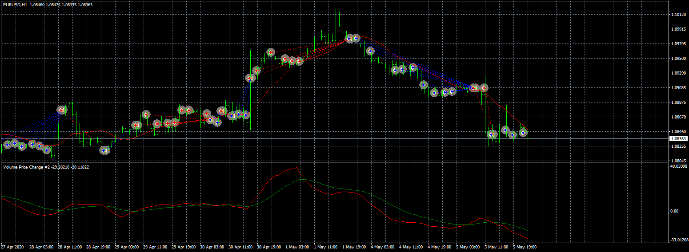
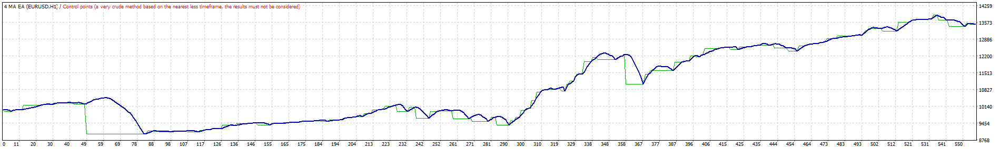

# 4 MA EA

> Source: https://fxcodebase.com/code/viewtopic.php?f=38&t=69810  
> Forum: 38 · Topic 69810 · 6 post(s)

---

## 4 MA EA

**Apprentice** · Wed May 06, 2020 6:32 am

 

Based on TS2/Lua version
[viewtopic.php?f=31&t=69284](https://fxcodebase.com/code/viewtopic.php?f=31&t=69284)

 [4 MA EA.mq4](files/133628/4%20MA%20EA.mq4)

Volume Price Change.mq4
[viewtopic.php?f=38&t=68550](https://fxcodebase.com/code/viewtopic.php?f=38&t=68550)

---

## Re: 4 MA EA

**marcoleghorn1972** · Sun May 10, 2020 2:47 am

at the moment, this ea don't work

---

## Re: 4 MA EA

**Apprentice** · Sun May 10, 2020 3:19 am

Fixed.

---

## Re: 4 MA EA

**marcoleghorn1972** · Sun May 10, 2020 8:03 am

Good morning apprentice, if the file to download is the one at the top of the page, the problem remained.
Thanks.
Bye.

---

## Re: 4 MA EA

**Apprentice** · Mon May 11, 2020 4:26 am

Try to re-download via different computer or browser.
The old file is probably in your buffer.

---

## Re: 4 MA EA

**clavez** · Fri May 22, 2020 3:44 pm

It's very good.
And indicator is exactly what I'm looking for.

Thanks
