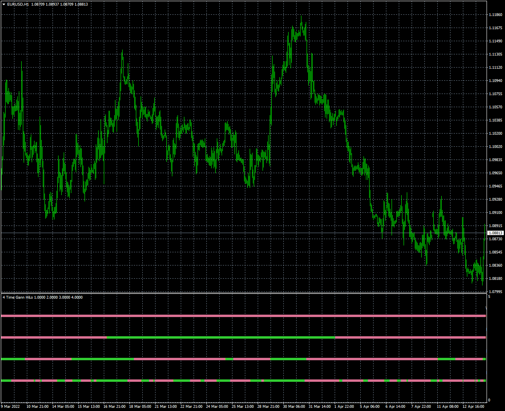
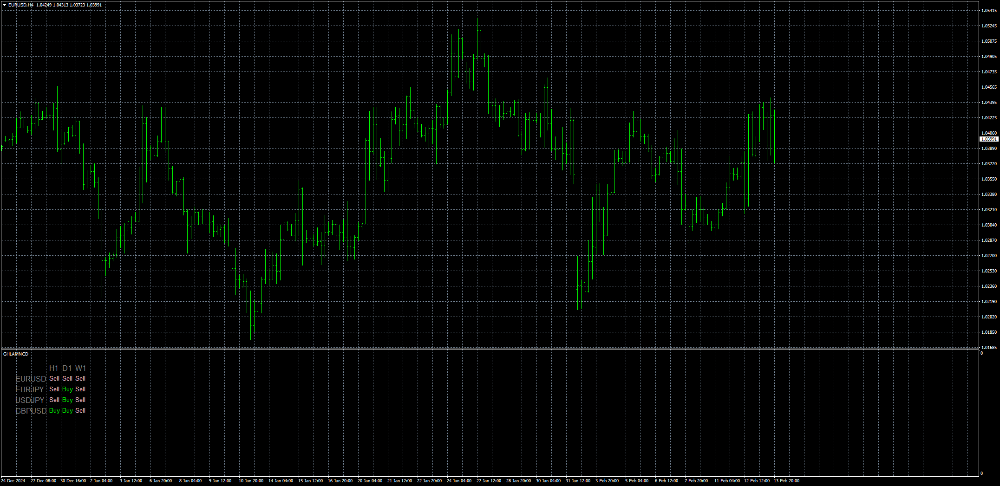

# 4-time-frame-gann-high-low-activator-nmc

> Source: https://fxcodebase.com/code/viewtopic.php?f=38&t=72087  
> Forum: 38 · Topic 72087 · 9 post(s)

---

## 4-time-frame-gann-high-low-activator-nmc

**Apprentice** · Wed Apr 13, 2022 11:53 am

Based on the request.
[https://fxcodebase.com/code/viewtopic.php?f=38&t=72022](https://fxcodebase.com/code/viewtopic.php?f=38&t=72022)

 [4-time-frame-gann-high-low-activator-nmc.mq4](files/145672/4-time-frame-gann-high-low-activator-nmc.mq4)

---

## Re: 4-time-frame-gann-high-low-activator-nmc

**Honest_Trader** · Wed Apr 13, 2022 11:37 pm

Thank you my friend. Appreciate your time.

Regards
GK

---

## Re: 4-time-frame-gann-high-low-activator-nmc

**Honest_Trader** · Mon Jun 13, 2022 10:43 am

Thank you Apprentice !

---

## Re: 4-time-frame-gann-high-low-activator-nmc

**Teruyoshi** · Mon Feb 03, 2025 10:48 am

Dear Apprentice, would you mind making gann high low activator dashboard?
Many thanks in advance.

---

## Re: 4-time-frame-gann-high-low-activator-nmc

**Apprentice** · Thu Feb 06, 2025 12:06 pm

We have added your request to the development list.
Development reference 93

---

## Re: 4-time-frame-gann-high-low-activator-nmc

**Apprentice** · Thu Feb 13, 2025 1:48 pm

 [gann-high-low-activator-nmc-dashboard.mq4](files/158224/gann-high-low-activator-nmc-dashboard.mq4)

---

## Re: 4-time-frame-gann-high-low-activator-nmc

**Teruyoshi** · Wed Jun 11, 2025 12:14 am

Could you modify a littel and add Y cordinate function to this dashboard so that I can set the positon as I want?
So many thanks in advance.

---

## Re: 4-time-frame-gann-high-low-activator-nmc

**Apprentice** · Thu Jun 12, 2025 12:17 pm

We have added your request to the development list.
Development reference 389

---

## Re: 4-time-frame-gann-high-low-activator-nmc

**Apprentice** · Wed Jun 18, 2025 11:14 am

“X offset (+/-)” and “Y offset (+/-)” options added

 [gann-high-low-activator-nmc-dashboard_v2.mq4](files/159615/gann-high-low-activator-nmc-dashboard_v2.mq4)
