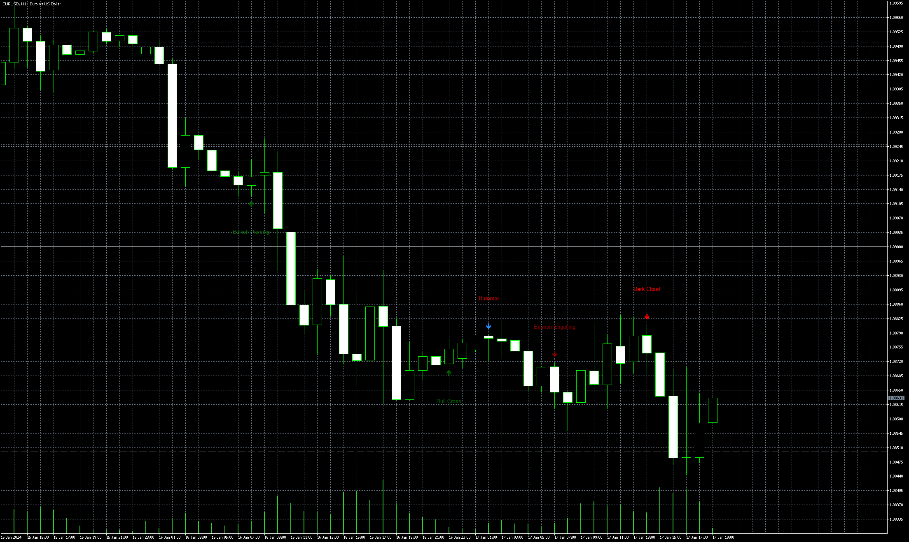

# _#4X_Bheurekso_Pattern_Alertonly

> Source: https://fxcodebase.com/code/viewtopic.php?f=38&t=75041  
> Forum: 38 · Topic 75041 · 5 post(s)

---

## _#4X_Bheurekso_Pattern_Alertonly

**Apprentice** · Mon Jul 08, 2024 1:42 pm

Based on the request.
[https://fxcodebase.com/code/viewtopic.p ... 43#p155943](https://fxcodebase.com/code/viewtopic.php?f=27&p=155943#p155943)

Since we received an .ex5 file, a separate indicator loads the base indicator, and this separate indicator also handles the alerts.

 [#4X Bheurekso Pattern.ex5](files/156051/4X%20Bheurekso%20Pattern.ex5)

 [_#4X_Bheurekso_Pattern_Alertonly.mq5](files/156051/_4X_Bheurekso_Pattern_Alertonly.mq5)

---

## Re: _#4X_Bheurekso_Pattern_Alertonly

**ROBUR888** · Tue Sep 03, 2024 7:56 am

Greetings. Is it possible to have this MT5 indicator with alerts but with individual pattern selection or where we can only turn on the alerts for patterns we only want? I hope I make sense. Thanks.

---

## Re: _#4X_Bheurekso_Pattern_Alertonly

**Apprentice** · Sun Sep 08, 2024 4:03 pm

Unfortunately, no, as we do not have the source code.

---

## Re: _#4X_Bheurekso_Pattern_Alertonly

**ROBUR888** · Mon Sep 09, 2024 3:47 am

Ok, thanks for the reply.

---

## Re: _#4X_Bheurekso_Pattern_Alertonly

**WorkingMan** · Sun May 18, 2025 9:27 am

Hi I tried to install this indicator how do I set it to give me signals?
