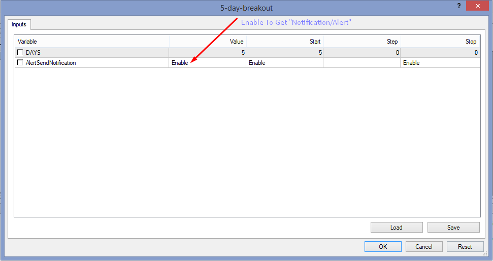

# 5-day-breakout

> Source: https://fxcodebase.com/code/viewtopic.php?f=38&t=72176  
> Forum: 38 · Topic 72176 · 5 post(s)

---

## 5-day-breakout

**Apprentice** · Sun May 15, 2022 2:24 pm

Based on the request.
[https://fxcodebase.com/code/viewtopic.php?f=38&t=72145](https://fxcodebase.com/code/viewtopic.php?f=38&t=72145)

 [5-day-breakout.mq4](files/145999/5-day-breakout.mq4)

---

## Re: 5-day-breakout

**Honest_Trader** · Wed May 18, 2022 12:18 am

Thanks mate, works perfectly as always with your magic touch. God bless.

But I find it strange both the high and low are appearing in red (line). I tried to check the code for the color (only ). I see for high it clearly says SpringGreen and for low Red, but still both for high and low it appears in Red. When you have time....

Thanks
GK

---

## Re: 5-day-breakout

**Apprentice** · Sun May 22, 2022 4:49 am

We have added your request to the development list.
Development reference 307.

---

## Re: 5-day-breakout

**Apprentice** · Mon Jun 06, 2022 2:07 pm

Try it now.

---

## Re: 5-day-breakout

**Honest_Trader** · Tue Jun 21, 2022 11:41 pm

Thanks mate, you are the little genie in the bottle for all of us granting all our wishes without a sneeze. God bless you my friend....

BR
~GK
