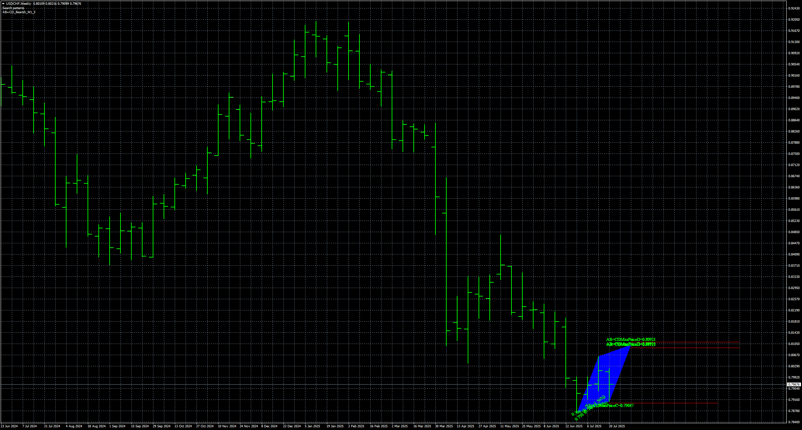

# 54_Search_patterns

> Source: https://fxcodebase.com/code/viewtopic.php?f=38&t=76321  
> Forum: 38 · Topic 76321 · 4 post(s)

---

## 54_Search_patterns

**Apprentice** · Sat Sep 27, 2025 2:39 pm

Based on the request.
[https://fxcodebase.com/code/viewtopic.p ... 74#p159574](https://fxcodebase.com/code/viewtopic.php?f=27&p=159574#p159574)

 [54_Search_patterns.mq5](files/160625/54_Search_patterns.mq5)

---

## Re: 54_Search_patterns

**mattrader** · Mon Oct 13, 2025 8:28 am

Thank you so much Apprentice.

---

## Re: 54_Search_patterns

**khanatd** · Mon Oct 20, 2025 11:50 pm

hi sir plz add mt4 non repaint arrows at close of current candle or reversals/continuations /breakers etc

thanks
khan

---

## Re: 54_Search_patterns

**Apprentice** · Tue Oct 21, 2025 9:43 am

We have added your request to the development list.
Development reference 684
