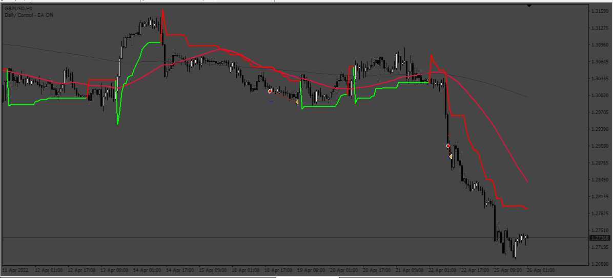
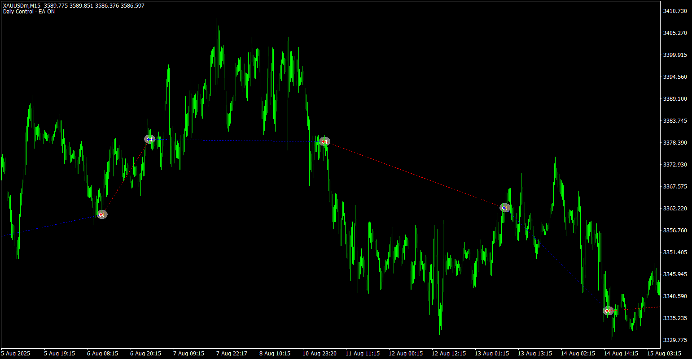

# 7_Confirmation_strategy_EA

> Source: https://fxcodebase.com/code/viewtopic.php?f=38&t=74739  
> Forum: 38 · Topic 74739 · 5 post(s)

---

## 7_Confirmation_strategy_EA

**Apprentice** · Wed Mar 27, 2024 5:44 am

Based on the request.
[https://fxcodebase.com/code/viewtopic.php?f=27&p=154738](https://fxcodebase.com/code/viewtopic.php?f=27&p=154738)

 [SuperTrend.ex4](files/154844/SuperTrend.ex4)

 [7_Confirmation_strategy_EA.mq4](files/154844/7_Confirmation_strategy_EA.mq4)

---

## Re: 7_Confirmation_strategy_EA

**aurelghirasim** · Fri Aug 29, 2025 6:25 am

Hi.
Can you add "Close on oposite signal" and a minimum distance betweeen slow and Fast MA options?
Tank you.

---

## Re: 7_Confirmation_strategy_EA

**aurelghirasim** · Fri Aug 29, 2025 6:27 am

Hi.
Can you add "close on oposite signal"option?
Thank you.

---

## Re: 7_Confirmation_strategy_EA

**Apprentice** · Sun Aug 31, 2025 3:33 am

We have added your request to the development list.
Development reference 552

---

## Re: 7_Confirmation_strategy_EA

**Apprentice** · Tue Sep 09, 2025 3:40 am

 [7_Confirmation_strategy_EA.mq4](files/160505/7_Confirmation_strategy_EA.mq4)
