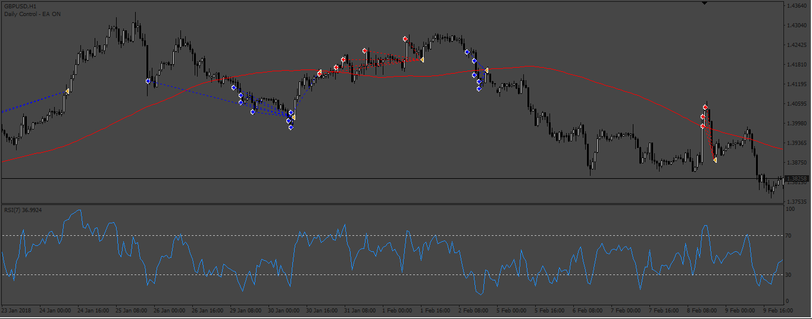
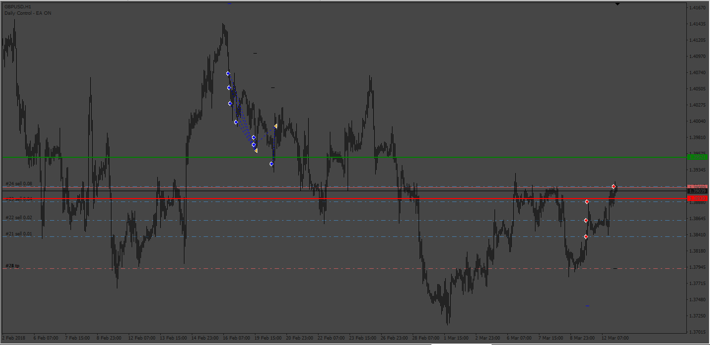
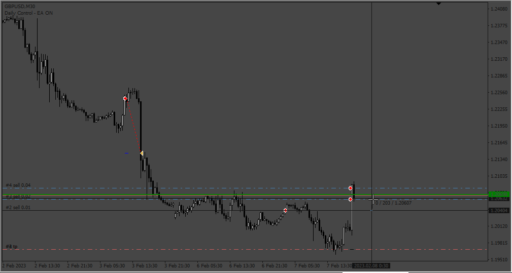
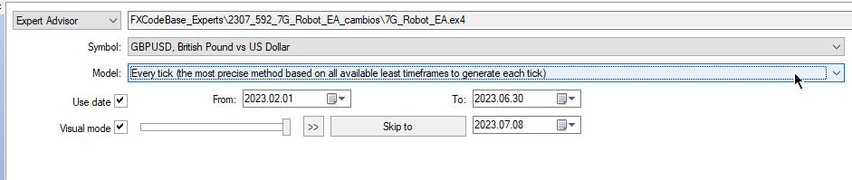
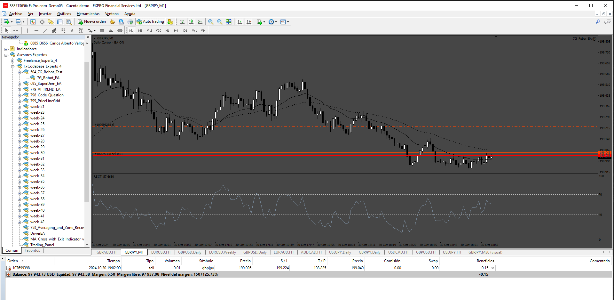

# 7G_Robot_EA

> Source: https://fxcodebase.com/code/viewtopic.php?f=38&t=73850  
> Forum: 38 · Topic 73850 · 14 post(s)

---

## 7G_Robot_EA

**Apprentice** · Tue Jun 20, 2023 12:52 pm

Based on the request.
[https://fxcodebase.com/code/viewtopic.php?f=27&p=151156](https://fxcodebase.com/code/viewtopic.php?f=27&p=151156)

 [7G_Robot_EA.mq4](files/151315/7G_Robot_EA.mq4)

---

## Re: 7G_Robot_EA

**cengo64** · Tue Jun 20, 2023 1:24 pm

İf we can add TMA MACD slope indi filter to this EA ,may be with MTF speciality it may be super.İts just an idea

---

## Re: 7G_Robot_EA

**cengo64** · Tue Jun 20, 2023 2:20 pm

And one more thing your experts is very slow on strategy tester.Can this be fixed

---

## Re: 7G_Robot_EA

**jollyjegan** · Wed Jun 21, 2023 3:20 am

> **Apprentice wrote:**
>
>
> The attachment **521pic.png** is no longer available
>
>
> Based on the request.
> [https://fxcodebase.com/code/viewtopic.php?f=27&p=151156](https://fxcodebase.com/code/viewtopic.php?f=27&p=151156)
>
>
> The attachment **521pic.png** is no longer available

SMALL CORRECTIONS NEED:-

1. IF LOT TAKEN MORE THAN ONE, AVERAGE TP(TARGET) IS CALCULATED & PLACED. THAT MEANS SINGLE TARGET FOR ALL ENTRIES.
2. ON ENTRY , THERE IS ONE SIDE BUY OR SELL ONLY TAKEN, CURRENTLY TAKEN BOTH SIDE ENTRIES, I TRIED ALL OPTIONS, NOT WORKING. KINDLY CHECK SCREENSHOT.

 

*ENTRIES ON BOTH SIDES*

3. INITIALLY TAKEN BUY ENTRY, IF MARKET GOES NEGATIVE THEN ONLY TAKES ANOTHER ENTRY AS PER GRID PARAMETERS.
4. EXPORT EVERY ENTRIES TO TELEGRAM.

---

## Re: 7G_Robot_EA

**Apprentice** · Wed Jun 21, 2023 9:13 am

We have added your request to the development list.
Development reference 540.

---

## Re: 7G_Robot_EA

**Apprentice** · Tue Jul 04, 2023 10:30 am

 [7G_Robot_EA.mq4](files/151504/7G_Robot_EA.mq4)

---

## Re: 7G_Robot_EA

**jollyjegan** · Wed Jul 05, 2023 12:17 am

> **Apprentice wrote:**
>
>
> The attachment **540pic.png** is no longer available
>
>
>
>
> The attachment **540pic.png** is no longer available

Dear Apprentice,
Previous errors are corrected. Thanks a lot.
In backtest, found one small error, as per the below screenshot, Gap set as 20 pips, but in this test, many entries took nearby previous entry. As per the strategy, each and every order will take only as per GAP mentioned in settings.For Example, first entry takes one point, next entry will be take only after the GAP mentioned in settings. this condition is for all entries.Kindly correct this error asap.

 

*Many entries took nearby*

Thanks in advance

---

## Re: 7G_Robot_EA

**Apprentice** · Fri Jul 07, 2023 1:21 pm

We have added your request to the development list.
Development reference 592.

---

## Re: 7G_Robot_EA

**Apprentice** · Tue Jul 11, 2023 2:41 am

 

 [7G_Robot_EA.mq4](files/151590/7G_Robot_EA.mq4)

---

## Re: 7G_Robot_EA

**psjohn** · Wed Jul 19, 2023 5:48 am

Dear Apprentice and other members,
I tried to put it on Exness demo account but couldn't make any trades. What's possibly wrong?

---

## Re: 7G_Robot_EA

**Apprentice** · Mon Apr 29, 2024 11:08 am

[40622](files/155194/298_Grid_limits.png)

 [7G_Robot_EA.mq4](files/155194/7G_Robot_EA.mq4)

---

## Re: 7G_Robot_EA

**duyprovipwe** · Fri Jun 14, 2024 1:58 pm

> **Apprentice wrote:**
>
>
> 298_Grid_limits.png
>
>
>
>
> 7G_Robot_EA.mq4

Dear Apprentice,
I tried to put it on Exness demo account but couldn't make any trades. The code is wrong somewhere or my settings does'nt right. Can you share the settings which can make trades on backtests and live trading?

---

## Re: 7G_Robot_EA

**Apprentice** · Sun Jun 16, 2024 9:43 am

We have added your request to the development list.
Development reference 504

---

## Re: 7G_Robot_EA

**Apprentice** · Mon Nov 04, 2024 5:12 am

 [7G_Robot_EA.mq4](files/157175/7G_Robot_EA.mq4)
