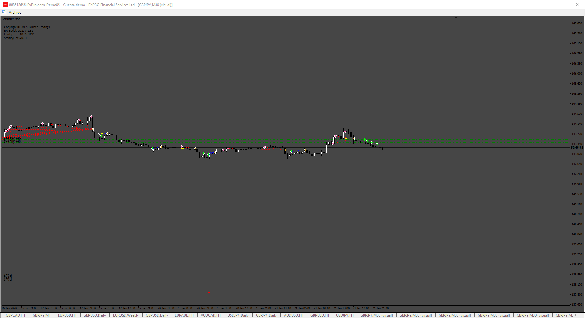
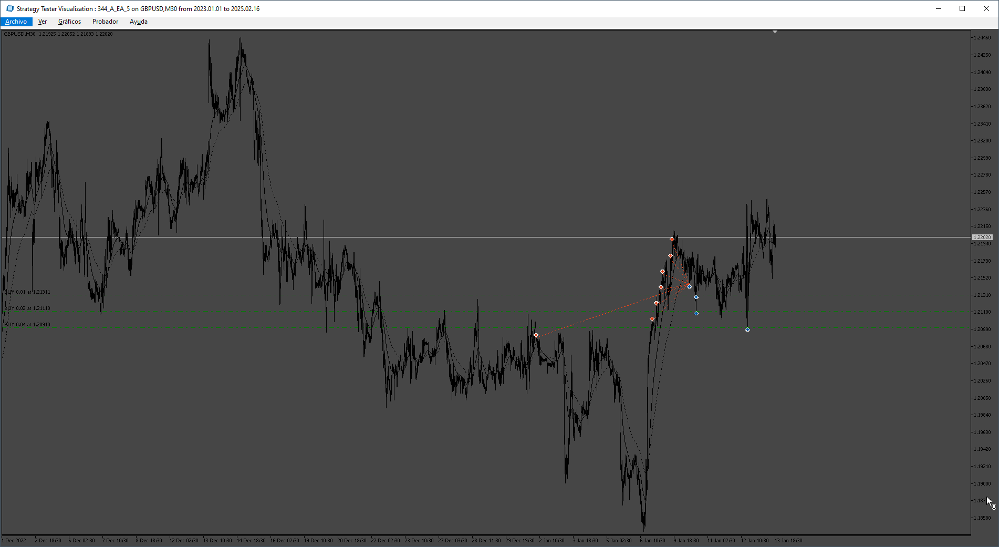

# A EA

> Source: https://fxcodebase.com/code/viewtopic.php?f=38&t=75337  
> Forum: 38 · Topic 75337 · 5 post(s)

---

## A EA

**Apprentice** · Mon Nov 04, 2024 5:16 am

Based on the request.
[https://fxcodebase.com/code/viewtopic.p ... 19#p156695](https://fxcodebase.com/code/viewtopic.php?f=27&t=75196&p=156695&hilit=719#p156695)

 [A EA.mq4](files/157176/A%20EA.mq4)

---

## Re: A EA

**Anderson18** · Fri May 23, 2025 5:58 am

would it possible to have this strategy in mq5, Thank youu soo much FXCODEBASE Teams!!

---

## Re: A EA

**Apprentice** · Sat May 24, 2025 2:34 pm

We have added your request to the development list.
Development reference 344

---

## Re: A EA

**Apprentice** · Thu Jun 12, 2025 4:09 am

 [A_EA_5.mq5](files/159585/A_EA_5.mq5)

---

## Re: A EA

**Anderson18** · Thu Jun 19, 2025 9:34 pm

> **Apprentice wrote:**
>
>
> 344.png
>
>
>
>
> A_EA_5.mq5

Thank Youu for your hard work!
