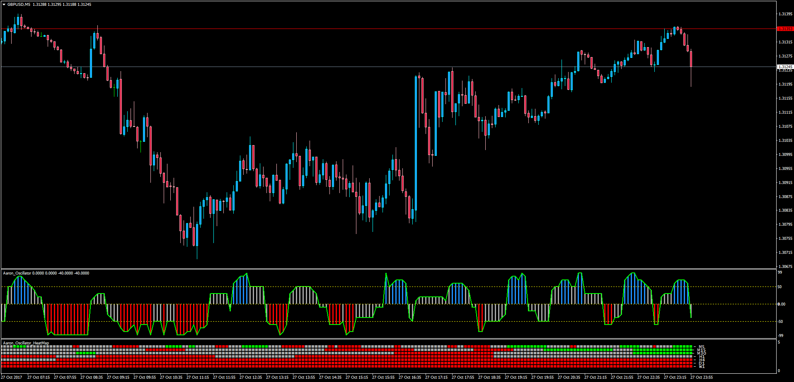

# Aaron Oscillator Heatmap

> Source: https://fxcodebase.com/code/viewtopic.php?f=38&t=65315  
> Forum: 38 · Topic 65315 · 5 post(s)

---

## Aaron Oscillator Heatmap

**Apprentice** · Sun Oct 29, 2017 5:15 am

LUA Original: [viewtopic.php?f=29&t=2989](https://fxcodebase.com/code/viewtopic.php?f=29&t=2989)

Description:

While the Aaron Oscillator of a single chart allow to receive an alert whenever the oscillator is going above or below the Aaron filter, this MT4 version of the LUA original Heatmap Dashboard allows to view at a glance the position of the oscillator above, below, or neutral of the Filter within the different time frames of the studied currency pair.

 [Aaron_Oscillator_HeatMap.mq4](files/115741/Aaron_Oscillator_HeatMap.mq4)

 [MTF_MCP_Aaron_Oscillator_HeatMap.mq4](files/115741/MTF_MCP_Aaron_Oscillator_HeatMap.mq4)

You will need to install Aaron_Oscillator.MQ4 for both.
[viewtopic.php?f=38&t=65312&p=115738&hilit=Aaron_Oscillator#p115738](https://fxcodebase.com/code/viewtopic.php?f=38&t=65312&p=115738&hilit=Aaron_Oscillator#p115738)

---

## Re: Aaron Oscillator Heatmap

**kolikol** · Sun Nov 05, 2017 2:17 am

Aaron Oscillator MTF exist?

---

## Re: Aaron Oscillator Heatmap

**Apprentice** · Sun Nov 05, 2017 4:29 am

Your request is added to the development list under Id Number 3941

---

## Re: Aaron Oscillator Heatmap

**kolikol** · Sun Nov 05, 2017 5:18 pm

> **Apprentice wrote:**
> Your request is added to the development list under Id Number 3941

Thank you very much.

---

## Re: Aaron Oscillator Heatmap

**Apprentice** · Mon Nov 06, 2017 9:27 am

MTF_MCP_Aaron_Oscillator_HeatMap.mq4 added.
