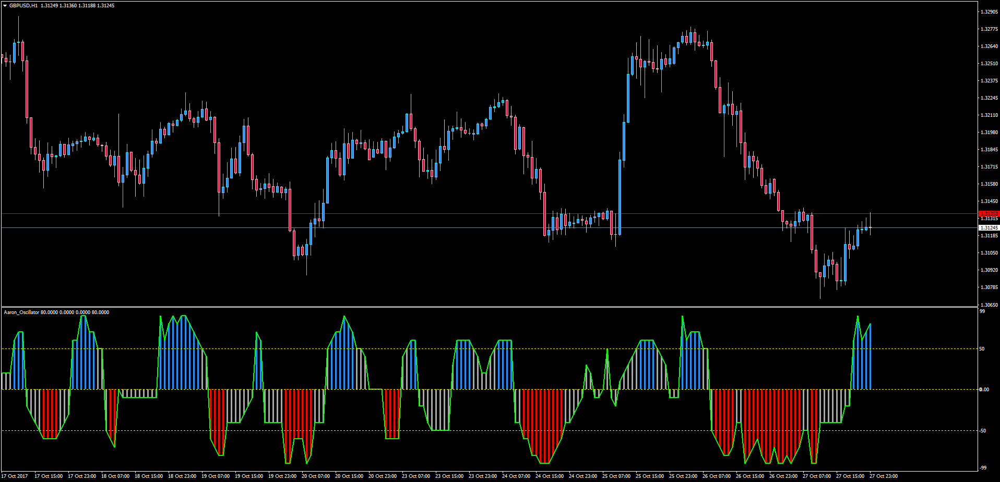

# Aaron Oscillator with Alert

> Source: https://fxcodebase.com/code/viewtopic.php?f=38&t=65312  
> Forum: 38 · Topic 65312 · 5 post(s)

---

## Aaron Oscillator with Alert

**Apprentice** · Sun Oct 29, 2017 5:05 am

LUA Original: [viewtopic.php?f=29&t=2989](https://fxcodebase.com/code/viewtopic.php?f=29&t=2989)

Description:

In this MT4 version of the LUA Original "Aaron Oscillator", the trader is able to receive an alert whenever the oscillator goes above or below the Aaron Filter.

 [Aaron_Oscillator.mq4](files/115738/Aaron_Oscillator.mq4)

Aaron_Oscillator based Heatmap can be found here.
[viewtopic.php?f=38&t=65315&p=115893#p115893](https://fxcodebase.com/code/viewtopic.php?f=38&t=65315&p=115893#p115893)

---

## Re: Aaron Oscillator with Alert

**kolikol** · Thu Jan 18, 2018 10:19 pm

Aaron Oscillator with time frame selector?

---

## Re: Aaron Oscillator with Alert

**taipan** · Mon Aug 24, 2020 9:53 pm

This is a good indicator but once alert is activated, it cannot be stopped untild we turn it off. Appreciate you can change it alert once and stop.

Thank you.

---

## Re: Aaron Oscillator with Alert

**Apprentice** · Tue Aug 25, 2020 5:34 am

Your request is added to the development list.
Development reference 1927.

---

## Re: Aaron Oscillator with Alert

**Apprentice** · Mon Aug 31, 2020 8:50 am

Try it now.
