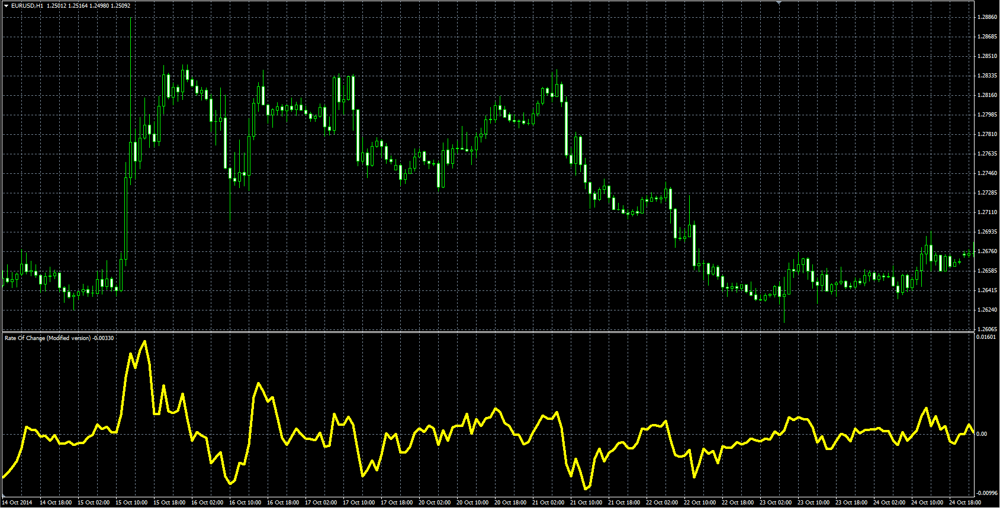

# Absolute Rate Of Change Value

> Source: https://fxcodebase.com/code/viewtopic.php?f=38&t=61624  
> Forum: 38 · Topic 61624 · 1 post(s)

---

## Absolute Rate Of Change Value

**Alexander.Gettinger** · Mon Dec 22, 2014 10:18 am

Original LUA oscillator: [viewtopic.php?f=17&t=3095](https://fxcodebase.com/code/viewtopic.php?f=17&t=3095).

Formulas:
ROCX = diff for Mode = Absolute value,
ROCX = 100*diff/PrN for Mode = % value,
ROCX = 1000*diff/PrN for Mode = %% value, where
diff[i] = Price[i]-Price[i-Length],
PrN = Price[i-Length].

 

Download:

 [ROCX.mq4](files/97828/ROCX.mq4)
