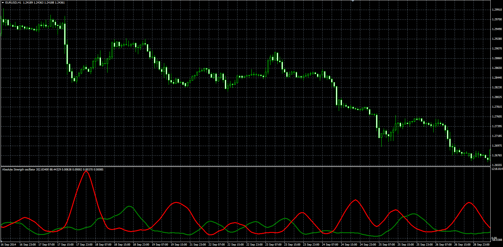

# Absolute Strength Histogram (ASH)

> Source: https://fxcodebase.com/code/viewtopic.php?f=38&t=61541  
> Forum: 38 · Topic 61541 · 1 post(s)

---

## Absolute Strength Histogram (ASH)

**Alexander.Gettinger** · Tue Nov 25, 2014 11:40 am

Original LUA oscillator: [viewtopic.php?f=17&t=3836](https://fxcodebase.com/code/viewtopic.php?f=17&t=3836).

Formulas:
BullsStrength = MA(AvgBulls) with [Smooth_Length] number of periods and [Method] type,
BearsStrength = MA(AvgBears) with [Smooth_Length] number of periods and [Method] type, where
AvgBulls = MA(Bulls) with [Length] number of periods and [Method] type,
AvgBears = MA(Bears) with [Length] number of periods and [Method] type,
Bulls = Price - Min,
Bears = Max - Price,
Min, Max - minimum and maximum prices at range from (i-Length+1) to (i).

 

Download:

 [ASH.mq4](files/97371/ASH.mq4)
