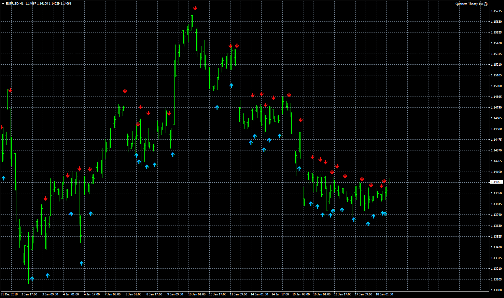

# AbsoluteStrength_MTF

> Source: https://fxcodebase.com/code/viewtopic.php?f=38&t=67282  
> Forum: 38 · Topic 67282 · 4 post(s)

---

## AbsoluteStrength_MTF

**Apprentice** · Fri Jan 18, 2019 8:48 am

 [AbsoluteStrength_MTF.mq4](files/123429/AbsoluteStrength_MTF.mq4)

---

## Re: AbsoluteStrength_MTF

**jsw_nz** · Wed Feb 13, 2019 9:19 pm

Hi Alex (et al)

I think this is a great indicator - however it is **not yet working** as described. Setting for next highest timeframe is **not showing arrows** (as it should - no?) - so basically this is still a single timeframe indicator - correct me if I am wrong. Might you take another look at this code and see if a fix can be arrived at.

Also - not sure if you could do this - but i already have a number of 'arrow indicators' on my charts - so wondering it you can change the use of arrows to >> display of 'vertical lines'. I came across a variant of this - which filters out 'against the trend' signals - NICE IDEA but the code is slightly broken - further back in timeline - it gives false signals. I am going to post the source on this one - for possilbe ideas - the key point here is the nice feature of looking at **next highest timeframe of absolutestrength**

cheers
john weare

re: posted source - shows vertical lines - but a bug in code for history beyond certain number of bars...just sayin.

---

## Re: AbsoluteStrength_MTF

**Apprentice** · Sat Feb 16, 2019 4:21 am

Try this version.

 [AbsoluteStrength_Histo_AlertLines_MTF.mq4](files/123946/AbsoluteStrength_Histo_AlertLines_MTF.mq4)

---

## Re: AbsoluteStrength_MTF

**jsw_nz** · Mon Mar 11, 2019 9:37 pm

Just wanted to say Thank You - this indi is now working as expected - setting to higher timeframe allows one to filter signals - finding that on on an M15 chart and setting the Shift Timeframe: Times to 2 (H1) or 3 (H4) gives some very good signals. Will be sending another PayPal donation shortly - nice work. Special Mention: **Mario Jemic**
