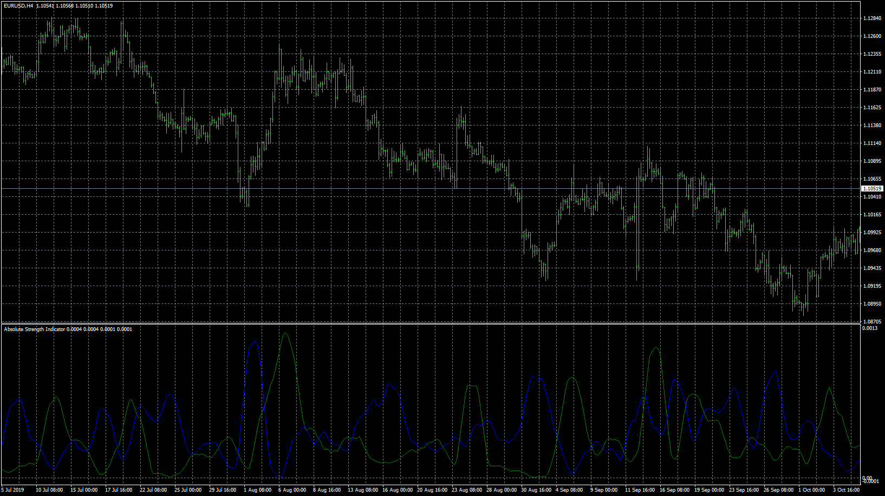

# AbsoluteStrengthIndicator

> Source: https://fxcodebase.com/code/viewtopic.php?f=38&t=69191  
> Forum: 38 · Topic 69191 · 8 post(s)

---

## AbsoluteStrengthIndicator

**Apprentice** · Wed Dec 04, 2019 4:51 pm

TS2/Lua version.
[viewtopic.php?f=17&t=2987&start=20](https://fxcodebase.com/code/viewtopic.php?f=17&t=2987&start=20)

 [AbsoluteStrengthIndicator.mq4](files/130071/AbsoluteStrengthIndicator.mq4)

 [AbsoluteStrengthIndicator with Alert.mq4](files/130071/AbsoluteStrengthIndicator%20with%20Alert.mq4)

---

## Re: AbsoluteStrengthIndicator

**dspill100** · Sat Dec 28, 2019 3:12 am

Can you add alerts to this indicator, when the singal lines cross?

---

## Re: AbsoluteStrengthIndicator

**Apprentice** · Sun Dec 29, 2019 6:06 am

Your request is added to the development list.
Development reference 499.

---

## Re: AbsoluteStrengthIndicator

**Apprentice** · Mon Dec 30, 2019 7:29 am

AbsoluteStrengthIndicator with Alert added.

---

## Re: AbsoluteStrengthIndicator

**dspill100** · Mon Dec 30, 2019 5:28 pm

Thanks!!!

---

## Re: AbsoluteStrengthIndicator

**dspill100** · Tue Dec 31, 2019 5:39 pm

The alert is working great but the alert wording is only "Bulls > Bears" no matter which line is getting crossing.

---

## Re: AbsoluteStrengthIndicator

**Apprentice** · Fri Jan 03, 2020 3:55 am

Your request is added to the development list.
Development reference 512.

---

## Re: AbsoluteStrengthIndicator

**Apprentice** · Mon Jan 06, 2020 8:51 am

[AbsoluteStrengthIndicator_with_Alert.mq4](files/130602/AbsoluteStrengthIndicator_with_Alert.mq4)

Try this version.
