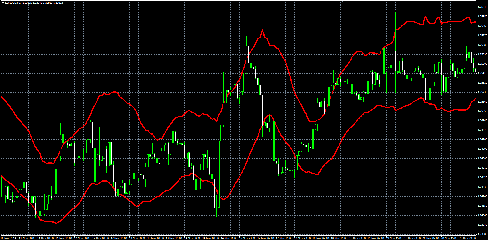

# Acceleration Bands (AB)

> Source: https://fxcodebase.com/code/viewtopic.php?f=38&t=61511  
> Forum: 38 · Topic 61511 · 1 post(s)

---

## Acceleration Bands (AB)

**Alexander.Gettinger** · Fri Nov 21, 2014 4:45 pm

Original LUA indicator: [viewtopic.php?f=17&t=1051](https://fxcodebase.com/code/viewtopic.php?f=17&t=1051).

> Developed by Price Headley, the Acceleration bands are based on the average trading range for each day. The values are plotted equidistant from an n-day simple moving average which serves as the center or middle band. The author indicates that successive days exceeding one of the bands tends to indicate an entry point.
> Because the bands use the daily trading range (high-low) they will also expand and contract based on the volatility of the price.

Formulas:
Top = MVA(Up) with [Length] number of periods,
Bottom = MVA(Dn) with [Length] number of periods, where
Up = High*(1+2*(2000*Factor*(High-Low)/(High+Low))),
Dn = High*(1-2*(2000*Factor*(High-Low)/(High+Low))).

 

Download:

 [AB.mq4](files/97277/AB.mq4)
