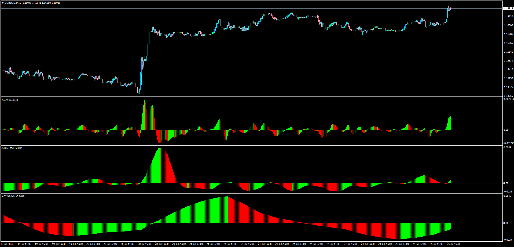

# Acceleration/Deceleration (AC) MTF

> Source: https://fxcodebase.com/code/viewtopic.php?f=38&t=64949  
> Forum: 38 · Topic 64949 · 1 post(s)

---

## Acceleration/Deceleration (AC) MTF

**Apprentice** · Tue Jul 25, 2017 10:31 am

LUA Original: [viewtopic.php?f=17&t=18](https://fxcodebase.com/code/viewtopic.php?f=17&t=18)

Description:

In this MT4 version the trader can select a higher timeframe and compare the Acceleration/Deceleration of different time frames at the same time.

AC bar chart is the difference between the value of 5/34 of the driving force bar chart and 5-period simple moving average, taken from that bar chart.

The height of an AC bar is the difference between 5-periods simple moving average and 34-periods simple moving average applied on a median price corresponding price bar. An AC bar is green in case it is above the previous bar and is red in case it is below the previous bar.

CALCULATION:

AC = SMA((HIGH + LOW) / 2; 5) - SMA((HIGH + LOW) / 2; 34)

 [Acceleration_Deceleration_AC_MTF.mq4](files/113730/Acceleration_Deceleration_AC_MTF.mq4)
