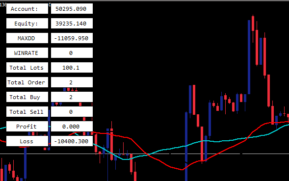
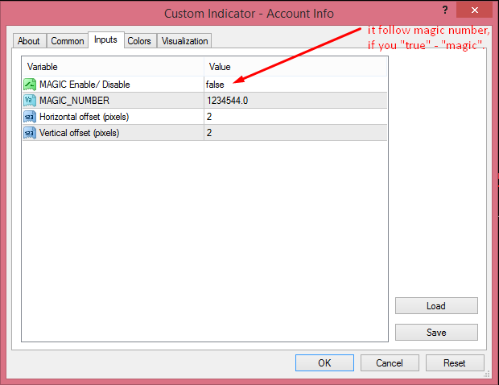

# Account_Info

> Source: https://fxcodebase.com/code/viewtopic.php?f=38&t=71965  
> Forum: 38 · Topic 71965 · 6 post(s)

---

## Account_Info

**Apprentice** · Mon Mar 14, 2022 9:18 am

 

 [Account_Info.docx](files/145339/Account_Info.docx)

Based on the request.
[https://fxcodebase.com/code/viewtopic.php?f=27&p=144927](https://fxcodebase.com/code/viewtopic.php?f=27&p=144927)

 [Account_Info.mq4](files/145339/Account_Info.mq4)

---

## Re: Account_Info

**forextraderaz** · Tue Mar 15, 2022 11:18 pm

I keep getting zero devide error everytime I try and load the indicator. Are you able to fix this issue? Thanks

---

## Re: Account_Info

**Apprentice** · Tue Mar 22, 2022 2:58 am

Try it now.

---

## Data time - Account number - daily control

**Joel Alves** · Tue Apr 05, 2022 12:32 am

Hi, I would like to add some information to:
 1 ) data_time : start and end

 2) int_account number :

3) Daily control:
input bool MondayOn = true;
input string MondayIni = "12:00";
input string MondayFin = "18:00";
input bool TuesdayOn = True;
input string TuesdayIni = "15:00";
input string TuesdayFin = "19:00";
input bool WednesdayOn = True;
input string WednesdayIni = "12:00";
input string WednesdayFin = "18:00";
input bool ThursdayOn = false;
input string ThursdayIni = "00:00";
input string ThursdayFin = "00:00";
input bool FridayOn = false;
input string FridayIni = "00:00";
input string FridayFin = "00:00";

Daily Target:
true / false = 0.20%
* when reaching the daily goal, the robot closes all orders and waits for the next day

---

## Re: Account_Info

**Apprentice** · Tue Apr 05, 2022 2:40 am

Your request is added to the development list.
Development reference 206.

---

## Re: Account_Info

**Apprentice** · Wed Apr 13, 2022 12:05 pm

Try this version.
[https://fxcodebase.com/code/viewtopic.php?f=38&t=72088](https://fxcodebase.com/code/viewtopic.php?f=38&t=72088)
