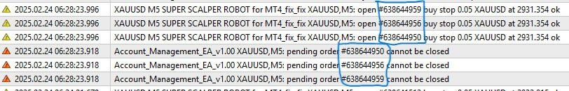
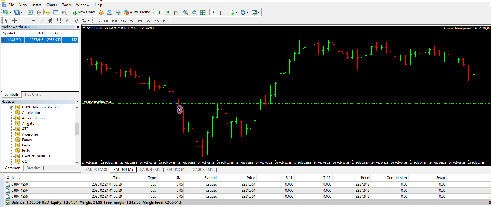

# Account_Management_EA

> Source: https://fxcodebase.com/code/viewtopic.php?f=38&t=75629  
> Forum: 38 · Topic 75629 · 19 post(s)

---

## Account_Management_EA

**Apprentice** · Wed Feb 19, 2025 6:46 am

Based on the request.
[https://fxcodebase.com/code/viewtopic.php?f=27&p=158172](https://fxcodebase.com/code/viewtopic.php?f=27&p=158172)

 [Account_Management_EA_v1.00.mq4](files/158309/Account_Management_EA_v1.00.mq4)

---

## Re: Account_Management_EA

**BeingSimple** · Fri Feb 21, 2025 2:47 am

With all due respects.
I highly thank the ADMIN @Apprentice for his incredible work & support to traders in this forum.
I also humbly thank him for making this EA happen. Thank you so much.

I have put this EA to work and waiting for feedback.

Onething i noticed is that, for some reason
EA is not able to cancel the pending orders.
So, after cancelling all OPEN ORDERS and also DISABLING AUTO TRADING.
The pending orders remain active.

These pending orders gets triggered later become OPEN orders.
Now, that the AUTO TRADING is already OFF. These new open orders goes unguided & becomes like a manual trade. Becomes unnoticed.

hereby request the ADMIN to
1. Make the EA close pending orders too
2. If possible, add ON/OFF time for the EA

Thank you so much for the work. Respects bro.

PS :
Soon i will be in your membership list.

---

## Re: Account_Management_EA

**Apprentice** · Sat Feb 22, 2025 5:32 am

We have added your request to the development list.
Development reference 133

---

## Re: Account_Management_EA

**BeingSimple** · Mon Feb 24, 2025 2:11 am

Dear @Apprentice bro...
Thank you for your response and accepting my request (**Development reference 133**)

I am attaching images of situations which i explained in last message

Image 1 : Shows our designed EA (Account_Management_EA) was not able to close pending orders

 

*Not able to close Pending Orders*

Image 2 : Those pending orders gets executed & becomes unmonitored trade orders
(also AUTO-TRADE is OFF, so regular EA also doesnot control it)

 

*Pending orders execute to become unmonitored*

Thank you so much

PS : One more request to follow in nest message.

---

## Re: Account_Management_EA

**BeingSimple** · Mon Feb 24, 2025 2:24 am

ONE MORE REQUEST @Apprentice bro :

Please add "Stoploss" and "Take profit functions" in Currency amount
(pips calculated SL or TP are confusing to set in 3 digits brokers).

Please keep these functions as User defined - through inputs values.

Example :
When the Loss reaches "X" USD (or) TP reaches "Y" USD.
The EA should get triggered &
CLOSE ALL ORDERS
OFF AUTO-TRADING

Note : If SL/TP is calculated based on the Balance/Equity amount.
Please calculate Loss/Profit based on regularly updating BALANCE AMOUNT.
I have used Equity Management EA which calculates SL/TP based on Equity value
(This Reference Equity Value in the Management EA gets updated when there is NO ORDERS) ...
But i found this method was not safe.
I will attach an image to show you the complication in this, where i have explained it.

 

*Problems when Calculating SL/TP with ref. to Equity Value*

Thank you so much for your cotntribution & Support.
please accept this request also & include it with Development reference 133
Thank you bro...

---

## Re: Account_Management_EA

**Apprentice** · Mon Feb 24, 2025 5:50 am

[Account_Management_EA_v1.00.mq4](files/158380/Account_Management_EA_v1.00.mq4)

Try this version.

---

## Re: Account_Management_EA

**BeingSimple** · Tue Feb 25, 2025 1:06 pm

> **Apprentice wrote:**
>
>
> Account_Management_EA_v1.00.mq4
>
>
> Try this version.

Thank you so much for the updated EA > APPRENTICE BRO
I will surely put into use today & will give you feedbacks on it.
Thank you

Kindly also consider my previous requests newer updates

1. Adding Inputs for Loss / Profit. Triggering Closing all orders & Disabling AUTO-TRADING

please add one more final feature to this EA bro...
Excuse me for adding up another NEW requests but i wanted to make it Best EA.

2. Please add time limit for re-enabling the AUTO-TRADING after "T" minutes. By this way, we will have auto-trading ON and it will continue trading ( also will take care of any orders that got executed from pending orders)

Example :
1. When MAX orders "A" is reached (or) Max lot size of "B" is reached
2. When the Loss reaches "X" USD (or) TP reaches "Y" USD
The EA should get triggered &
CLOSE ALL ORDERS
OFF AUTO-TRADING
3. After "T" minutes, the EA should re-enable AUTO-TRADING.

A / B / X / Y /T - all Five variables user defined through inputs...
[Already we have 2 variables (A & B) included in the EA]

Thank you so much for your support

---

## Re: Account_Management_EA

**Apprentice** · Tue Mar 04, 2025 5:47 am

We have added your request to the development list.
Development reference 159

---

## Re: Account_Management_EA

**Apprentice** · Thu Mar 06, 2025 3:16 pm

[Account_Management_EA_v1.00.mq4](files/158503/Account_Management_EA_v1.00.mq4)

Try this version.

---

## Re: Account_Management_EA

**Apprentice** · Thu Mar 06, 2025 3:51 pm

Task 159

 [Account_Management_EA_v1.10.mq4](files/158515/Account_Management_EA_v1.10.mq4)

---

## Re: Account_Management_EA

**BeingSimple** · Sun Mar 09, 2025 12:52 am

Thank you so much brother..
I really wish & thank you whole heartedly for your extraordinary work...

1. I could not try this EA extensively on Friday for much time, As it was market closing hours for week end.

2. But i did tried it out for few hours. EA was great.
But i could sense a small issue.. Which sounds silly but i need to try the EA out further to decide on it.
The Issue : I had put the EA on parallel chart & allowed it to do its work.
After a while, the EA had got triggered & Disabled AUTO-TRADING as designed. which was great.

But what i noticed was,
As soon as i saw the EA got triggered, i came in. Fixed few things in the orders
& Disabled the Our EA (Account Management EA) through Inputs, to start the Auto-Trading again.
But to my surprise, i could out turn it ON, i tried for atleast 10 times to see what is happening...
i also checked whether out EA was disabled properly so that, it doesnot function.
Though out EA was disabled, the AUTO-TRADING was not allowing me to Turn On.

I then closed the Chart which had out EA attached. Then i tried to Siwtch On the AUTO-TRADE
This time, it was possible as usual.
So, i think, our EA is interfering in the AUTO-TRADING feature even though it was our EA is DISABLED.

ANYWAY, PLEASE GIVE ME SOME MORE TIME. I WILL CHECK IT OUT & COME BACK TO YOU WITH PROPER EVIDENCES, SO THAT WE CAN RESOLVE THE ISSUE, IF IT PERSISTS.

THANK YOU SO MUCH Admin bro...

( PS: please add few more emojis (like in whatsapp). i could not use right emoji to thank you.
We in india use __/\__joined hands to say thank you, which is not available in our forum comment space. Just a small silly request. Thats it )

---

## Re: Account_Management_EA

**Apprentice** · Mon Mar 10, 2025 2:31 pm

We have added your request to the development list.
Development reference 171

---

## Re: Account_Management_EA

**BeingSimple** · Sun Mar 16, 2025 4:40 pm

Dear APPRENTICE BRO
Thank you so much for the updated version EA.
I am using it & it is working fine but still not tried it out fully.
few features are still needed to be tested out in real time.
looking forward in doing it.

Meanwhile,
I wanted to give a feedback to you to make this EA much better.
Kindly also consider my previous requests to newer updates.

One feature i wanted to add on is :

1. Adding Inputs to our EA to monitor orders from a particular EA
Now, with all the prevailing conditions & inputs of the account management EA.
is it possible to instruct EA to monitor orders from one particular EA or one particular Chart alone.

**Fore Example :**

I have following charts open on my terminal..
Chart 1 : Elephant EA (which leaves comment as '1234' on every order made by it)
Chart 2 : Tiger EA (which leaves comment as '6789' on every order made by it)

Chart 3 : Account_Management_EA 1
Chart 4 : Account_Management_EA 2
[Chart 3 & 4 EAs will have different Magic Numbers...]

Here,
I want the Account Mangement EA 1 (Chart 3) to monitor only orders with Comment '1234'
(From Elephant EA)
I want the Account Mangement EA 2 (Chart 4) to monitor only orders with Comment '6789'
(From Tiger EA)

and execute conditions based actions individually while being on same terminal but different charts
This feature will help us RUN 2 or more EAs in a same forexaccount with multiple different EAs.

Thank you so much for your support
BeingSimple

PS : Please check your Private Messages bro.. I needed some information. from you. Thank you

---

## Re: Account_Management_EA

**Apprentice** · Sun Apr 20, 2025 10:35 am

[Account_Management_EA_v1.20.mq4](files/158995/Account_Management_EA_v1.20.mq4)

Try this version.

---

## Re: Account_Management_EA

**BeingSimple** · Thu Apr 24, 2025 6:02 pm

> **Apprentice wrote:**
>
>
> Account_Management_EA_v1.20.mq4
>
>
> Try this version.

Thank you so much brother...
I will try it out on charts & will leave you feedback on it.

Respects...

---

## Re: Account_Management_EA

**BeingSimple** · Fri May 23, 2025 12:03 am

> **Apprentice wrote:**
> Task 159
>
>
> The attachment **Account_Management_EA_v1.10.mq4** is no longer available

Dear Apprentice bro
In the above EA which you took effort and created on my request.
I would again request you to add a small feature which i requested on my previous post on this thread.
(i.e) In this Account Management EA, it **"Disables AUTO-TRADING & Closes all Orders"** once any one of the multiple condition meets, but the problem is the AUTO-TRADING gets enabled again immediately in few seconds which spoils the whole purpose of the EA.
So please add a Time Based Input for re-enabling of "AUTO-TRADING" after "T-Seconds/Minutes" after the Disabling.

Thank you bro...

PS: Please find the attached image of the log file, where you can see, the EA disables AUTO TRADING but it re-enables in a second and ordering starts again.

 

*Please check immediate occurrence of Enabling & Order continue to flow*

---

## Re: Account_Management_EA

**Apprentice** · Sat May 24, 2025 2:35 pm

We have added your request to the development list.
Development reference 345

---

## Re: Account_Management_EA

**BeingSimple** · Sun May 25, 2025 8:22 pm

> **Apprentice wrote:**
> We have added your request to the development list.
> Development reference 345

Thank you brother
I will be waiting for the response...

---

## Re: Account_Management_EA

**Apprentice** · Wed Jun 04, 2025 3:17 pm

[Account_Management_EA_v1.30.mq4](files/159447/Account_Management_EA_v1.30.mq4)

Try this version.
