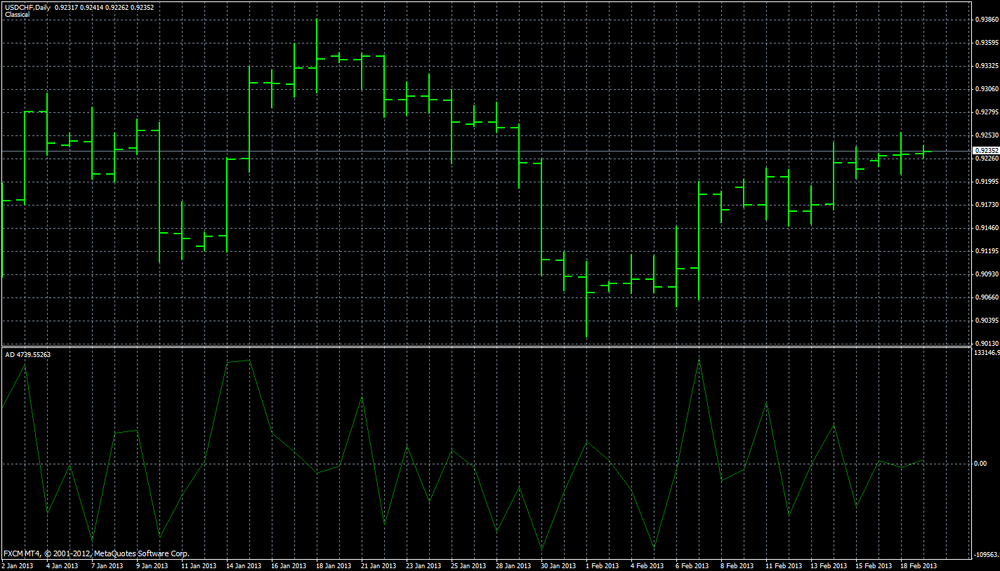

# Accumulation Distribution Indicator

> Source: https://fxcodebase.com/code/viewtopic.php?f=38&t=34264  
> Forum: 38 · Topic 34264 · 3 post(s)

---

## Accumulation Distribution Indicator

**Apprentice** · Tue Apr 09, 2013 9:05 am

Choose one of the three methods
**1.Classical**
AD= (((Close - Low ) - (High - Close )) / (High - Low )) * Volume ;

**2.Classical Incremental**
AD= AD[-1] + (((Close - Low ) - (High - Close )) / (High - Low )) * Volume ;

**3. Trade Station Incremental**
AD = AD[-1] -((Close - Open) / (High - Low)) * Volume

 [AD.mq4](files/58459/AD.mq4)

---

## Re: Accumulation Distribution Indicator

**Robertbob** · Tue Apr 09, 2013 12:09 pm

DEAR SIR !

What is actually the AD[-1] calculation in front of Classical Incremental and Trade Station AD modes ? Thanks a lot once again ! POZDRAV

---

## Re: Accumulation Distribution Indicator

**Apprentice** · Wed Apr 10, 2013 2:41 am

AD[-1] Stands for previous period AD.
Basically AD is then cumulative.
Adds the current period AD value to previous period cumulative AD.
