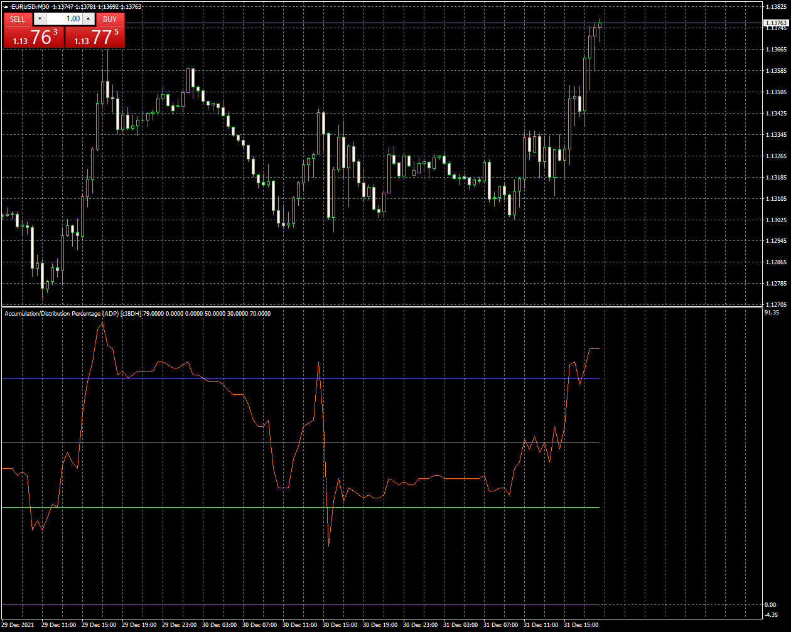
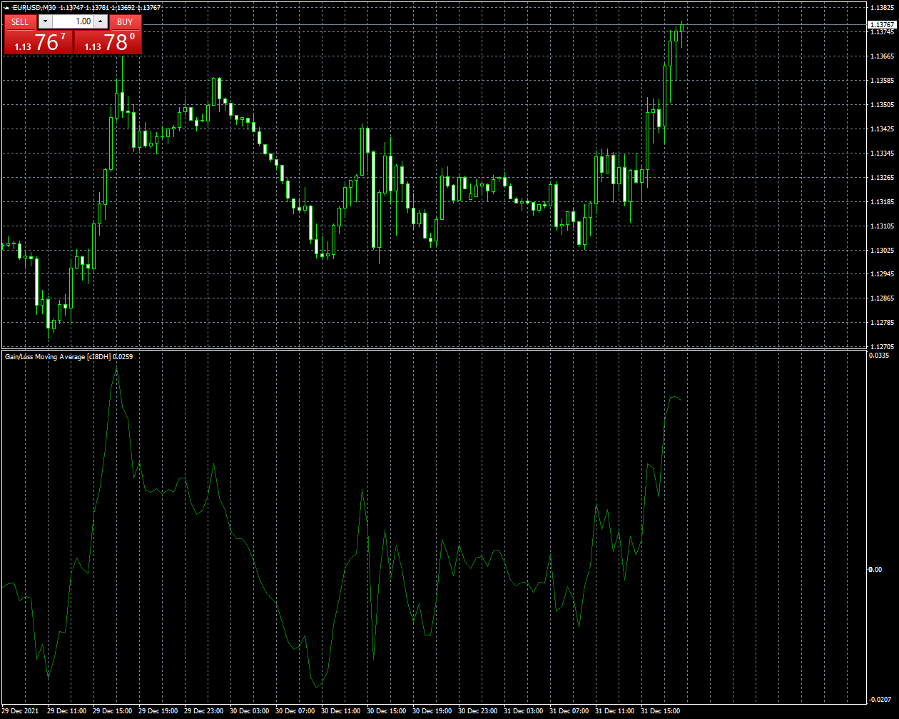
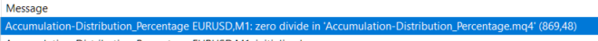

# Accumulation-Distribution_Percentage

> Source: https://fxcodebase.com/code/viewtopic.php?f=38&t=71752  
> Forum: 38 · Topic 71752 · 11 post(s)

---

## Accumulation-Distribution_Percentage

**Apprentice** · Fri Dec 31, 2021 11:48 am

Based on the request.
[https://fxcodebase.com/code/viewtopic.php?f=27&p=144486](https://fxcodebase.com/code/viewtopic.php?f=27&p=144486)

 [Accumulation-Distribution_Percentage.mq4](files/144591/Accumulation-Distribution_Percentage.mq4)

---

## Gain-Loss_Moving_Average

**Apprentice** · Fri Dec 31, 2021 11:50 am

 [Gain-Loss_Moving_Average.mq4](files/144592/Gain-Loss_Moving_Average.mq4)

---

## Re: Accumulation-Distribution_Percentage

**darvo77** · Sun Jan 02, 2022 7:02 am

Hi found a bug in ADP.
GLMA here not work well
check picture

---

## Re: Accumulation-Distribution_Percentage

**Apprentice** · Mon Jan 03, 2022 4:11 am

Your request is added to the development list.
Development reference 3.

---

## Re: Accumulation-Distribution_Percentage

**richard19** · Fri Jan 07, 2022 7:52 pm

> **Apprentice wrote:**
>
>
> The attachment **eurusd-m30-fxcm-australia-pty.png** is no longer available
>
>
> Based on the request.
> [https://fxcodebase.com/code/viewtopic.php?f=27&p=144486](https://fxcodebase.com/code/viewtopic.php?f=27&p=144486)
>
>
> The attachment **eurusd-m30-fxcm-australia-pty.png** is no longer available

Hi App

The AD % throws out zero divide error, could you please check?

 

regards
richard

---

## Re: Gain-Loss_Moving_Average

**richard19** · Fri Jan 07, 2022 8:16 pm

> **Apprentice wrote:**
>
>
> The attachment **eurusd-m30-fxcm-australia-pty-2.png** is no longer available
>
>
>
>
> The attachment **eurusd-m30-fxcm-australia-pty-2.png** is no longer available

Hi Apprentice

In this indicator, the MA_type has some issues. Looks like it is fixed to "Smoothed", either its smoothed or not, that's all it takes

Could you please add the slectable standard ma type option, please?

regards
richard

 [34220](files/144683/glma.png)

---

## Re: Accumulation-Distribution_Percentage

**richard19** · Wed Jan 26, 2022 7:42 am

Hi Apprentice,

Hope the AD percentage will be fixed soon. Looking forward to that.

thank you

cheers
richard

---

## Re: Accumulation-Distribution_Percentage

**richard19** · Sat Feb 26, 2022 9:07 pm

Hi Apprentice,

Could you please help fix the bugs in the indicator, please? Specifically, keen on the AD percentage.

cheers
richard

---

## Re: Accumulation-Distribution_Percentage

**Apprentice** · Mon Feb 28, 2022 10:02 am

Your request is added to the development list.
Development reference 130.

---

## Re: Accumulation-Distribution_Percentage

**richard19** · Sun Mar 20, 2022 8:53 am

Hi Apprentice,

Could you please look at this request?

regards
richard.

---

## Re: Accumulation-Distribution_Percentage

**Apprentice** · Sat Feb 01, 2025 4:06 pm

Updated.
