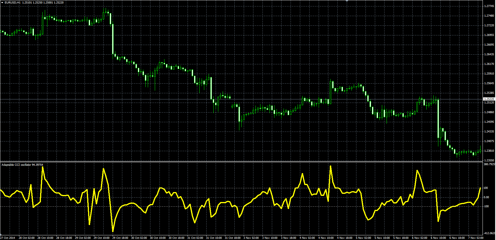

# Adaptable CCI

> Source: https://fxcodebase.com/code/viewtopic.php?f=38&t=61465  
> Forum: 38 · Topic 61465 · 1 post(s)

---

## Adaptable CCI

**Alexander.Gettinger** · Tue Nov 18, 2014 11:44 am

Original LUA oscillator: [viewtopic.php?f=17&t=20800](https://fxcodebase.com/code/viewtopic.php?f=17&t=20800).

Formulas:
ACCI[i] = (Price[i]-mean)/(meandev*Correction_Factor), where
mean = MA(Price) with [Average_Length] number of periods and [Method] type,
meandev = SumD/Deviation_Length,
SumD - sum of Abs(Price-Avg) at range from (i-Deviation_Length+1) to (i),
Avg = MVA(Price) with [Deviation_Length] numner of periods,
Abs - absolute value.

 

Download:

 [Adaptable_CCI.mq4](files/97156/Adaptable_CCI.mq4)
