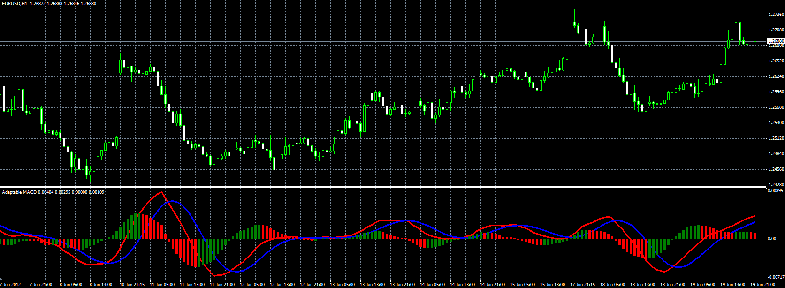

# Adaptable MACD

> Source: https://fxcodebase.com/code/viewtopic.php?f=38&t=20397  
> Forum: 38 · Topic 20397 · 6 post(s)

---

## Adaptable MACD

**Alexander.Gettinger** · Tue Jun 19, 2012 5:38 pm

Original indicator: [viewtopic.php?f=17&t=3274](https://fxcodebase.com/code/viewtopic.php?f=17&t=3274)

> This indicator allows you to change type of moving averages used to calculate the MACD indicator.

 

Download:

 [Adaptable_MACD.mq4](files/35766/Adaptable_MACD.mq4)

TS2/Marketscope version is available here.
[viewtopic.php?f=17&t=63771&p=107733#p107733](https://fxcodebase.com/code/viewtopic.php?f=17&t=63771&p=107733#p107733)

---

## Re: Adaptable MACD

**lrathi** · Tue Feb 12, 2013 1:20 am

in this version of adaptable MACD....
Is the height and width of MACD histogram adjustable?

If no, is it possible to change the code so it is.

Many thanks

---

## Re: Adaptable MACD

**Alexander.Gettinger** · Tue Feb 12, 2013 5:38 pm

> **lrathi wrote:**
> in this version of adaptable MACD....
> Is the height and width of MACD histogram adjustable?

I don't understand your question.

---

## Re: Adaptable MACD

**lrathi** · Tue Feb 12, 2013 6:18 pm

[viewtopic.php?f=17&t=229](https://fxcodebase.com/code/viewtopic.php?f=17&t=229)

On this thread above link for a different platform there is a version of MACD with a "HISTOGRAM MULTIPLIER" input that could change the height of the histogram bars.

I was referring to this feature.

Many thanks

---

## Re: Adaptable MACD

**Apprentice** · Thu Feb 14, 2013 4:00 am

[Adaptable_MACD.mq4](files/54637/Adaptable_MACD.mq4)

---

## Re: Adaptable MACD

**lrathi** · Thu Feb 14, 2013 7:11 am

Many thanks apprentice

> **Apprentice wrote:**
>
>
> Adaptable_MACD.mq4
