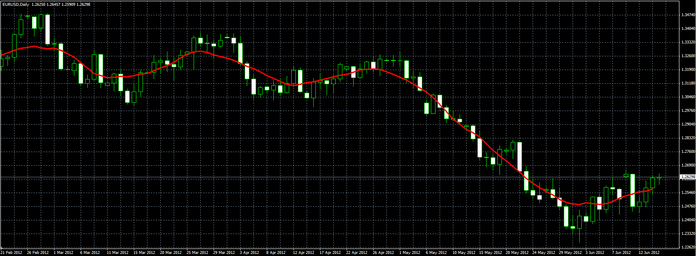

# Adaptable Moving Average

> Source: https://fxcodebase.com/code/viewtopic.php?f=38&t=20223  
> Forum: 38 · Topic 20223 · 1 post(s)

---

## Adaptable Moving Average

**Alexander.Gettinger** · Fri Jun 15, 2012 10:34 am

Original indicator: [viewtopic.php?f=17&t=19841&p=34988](https://fxcodebase.com/code/viewtopic.php?f=17&t=19841&p=34988)

 

Download:

 [AMA.ex4](files/35548/AMA.ex4)
