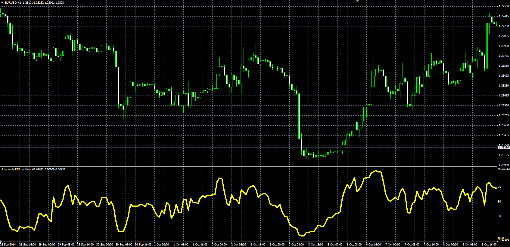

# Adaptable RSI

> Source: https://fxcodebase.com/code/viewtopic.php?f=38&t=61478  
> Forum: 38 · Topic 61478 · 1 post(s)

---

## Adaptable RSI

**Alexander.Gettinger** · Tue Nov 18, 2014 5:12 pm

Original LUA oscillator: [viewtopic.php?f=17&t=9358](https://fxcodebase.com/code/viewtopic.php?f=17&t=9358).

Formulas:
ARSI = 100-100/(1+MA_Gain/MA_Loss), where
MA_Gain = MA(Gain) with [Length] number of periods and [Method] type,
MA_Loss = MA(Loss) with [Length] number of periods and [Method] type,
Gain = diff, if diff>0, else Gain = 0,
Loss = -diff, if diff<0, else Loss = 0,
diff[i] = Price[i]-Price[i-1].

 

Download:

 [Adaptable_RSI.mq4](files/97184/Adaptable_RSI.mq4)
