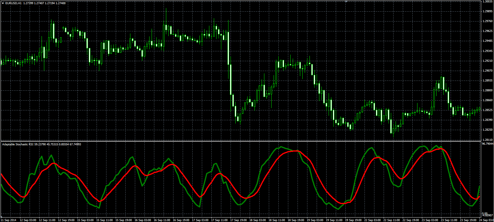

# Adaptable Stochastic RSI

> Source: https://fxcodebase.com/code/viewtopic.php?f=38&t=61452  
> Forum: 38 · Topic 61452 · 1 post(s)

---

## Adaptable Stochastic RSI

**Alexander.Gettinger** · Mon Nov 17, 2014 5:08 pm

Original LUA oscillator: [viewtopic.php?f=17&t=22756](https://fxcodebase.com/code/viewtopic.php?f=17&t=22756).

Formulas:
K = 100*MA(SKI) with [K_Smooth_Length] number of periods and [K_Smooth_Method] type,
D = MA(K) with [D_Smooth_Length] number of periods and [D_Smooth_Method] type, where
SKI[i] = (RSI[i]-Min)/(Max-Min),
Max, Min - maximum and minimum values of RSI at range from (i-Stoch_K_Length+1) to (i),
RSI - Relative Strength Index with [RSI_Length] number of periods.

 

Download:

 [Adaptable_StochRSI.mq4](files/97121/Adaptable_StochRSI.mq4)
