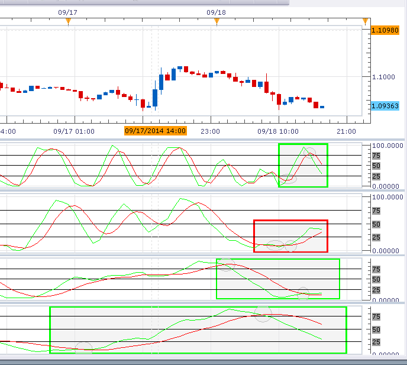

# Adaptable StochRSI

> Source: https://fxcodebase.com/code/viewtopic.php?f=38&t=61176  
> Forum: 38 · Topic 61176 · 2 post(s)

---

## Adaptable StochRSI

**ThemBonez** · Thu Sep 18, 2014 10:19 am

Hello,
I want to create an Adaptable indicator in MT4 based on the Stochastic RSI indicator using on the following criteria. I want to preface this by saying that I am learning to program MQL4 and I do not want you to create it for me. But since this will be my first programming project, it would be great if you could give me some pointers on how to create this indicator.

My Criteria

When I use the stochrsi indicator, I always look at 4 different graphs based on this 4 different setting groups: (RSI, K, K Slowing, D) 34,21,13,13; 21,13,8,8; 13,8,5,5; and 8,5,3,3. I look at all four indicator windows and note when the previous two K/D crossovers occurred prior to the current price bar. I only use the setting groups whose previous two k/d crossovers happened either in the oversold or overbought zones. If either of the previous 2 crossovers occurred outside of the OB/OS zones. I eliminate the indicator with those settings. Of the indicators remaining, I choose the indicator with the highest settings group. (i.e. If 34,21,13,13 and 21,13,8,8 both have the last 2 crossovers in the OB/OS zones, I would use the 34,21,13,13 settings).

What I would like to create is an algorithm to analyze the history of these 4 setting groups and choose the settings to utilize based on the above criteria automatically and then draw the lines based on those settings.

Here is a graphic example:

 



The green boxes show three stochrsi charts that meet the criteria and the red shows one that does not. The circle show the position of the last 2 crossovers. Since the 8,5,3,3; 21,13,8,8; and, 34,21,13,13 all meet the criteria, I would use the 34,21,13,13 chart for my trading decisions since it is the highest.

I hope this is clear as to what I want to do.

It would be great if you could give me some pointers on how to take the current StochRsi code and modify it to make this happen.

Thank You
ThemBonez

 [Stoch_RSI.mq4](files/95993/Stoch_RSI.mq4)

---

## Re: Adaptable StochRSI

**ThemBonez** · Sun Sep 21, 2014 3:01 pm

Hello
I've created some tester code to see if I could get the computer to analyze the Stochrsi indicator and give me alerts. Its working except for one portion of the code that it seems to be skipping. Heres the code:
C=Crossover count
L=Indicator that K>D and therefore "Long"
S=Indicator that K<D and therefore "Short"
T=Indicator I will use later
Bar=Bar being Analyzed

EVerything is working good, but the section after " Else If (S==1)" is totally being skipped.
Any ideas what's wrong.

Ps....I added this code to the Stochastic Rsi code between the lines that calculate D[pos] and the final return(0) and when I add the Stochastic Rsi indicator to the window the alerts show

Thank You

```mql4
int C,  L,  S,  T, Bar ;
 Bar=1;
C=0; L=0; S=0; T=0;

   while(Bar>=0)
   {
   if (K[Bar]>D[Bar])
     {
            Alert("Bar", Bar, ": K is greater than D. K=",K[Bar],"D=",D[Bar],"C=",C,"T=",T,"L=",L,"S=",S);
            L=1; S=0; Bar++;
            continue;
      }
     else
      if (L==1)
         {
            C++;
               if (K[Bar]<25 && D[Bar]<25)
                 { Alert("We have our first Long Crossover below 25 at Bar", Bar, "K=",K[Bar],"D=",D[Bar],"C=",C,"T=",T,"L=",L,"S=",S);
                  break;}
               else
               {
                  T++;
                  Alert("Bad long crossover at", Bar,"!  Change settings and start over. K=",K[Bar],"D=",D[Bar],"C=",C,"T=",T,"L=",L,"S=",S);
                  break;
                  }
         }
        else
            if (K[Bar]<D[Bar])
               {
                  Alert("Bar", Bar, ": D is greater than K.  K=",K[Bar],"D=",D[Bar],"C=",C,"T=",T,"L=",L,"S=",S);
                  L=0; S=1; Bar++;
                                 }
               else
                  if (S==1)
                     { C++; Alert("I'm Here!  K=",K[Bar],"D=",D[Bar],"C=",C,"T=",T,"L=",L,"S=",S);
                       
                           if (K[Bar]>75 && D[Bar]>75)
                             { Alert("We have our first Short Crossover Above 75 at Bar", Bar, "K=",K[Bar],"D=",D[Bar],"C=",C,"T=",T,"L=",L,"S=",S);
                              break;}
                           else
                              {T++;
                                    Alert("Bad short crossover at", Bar,"!  Change settings and start over. K=",K[Bar],"D=",D[Bar],"C=",C,"T=",T,"L=",L,"S=",S);
                                    break;
                               }
                        }
                      else
                       { Alert ("Go to Zero Algorithm.  K=",K[Bar],"D=",D[Bar],"C=",C,"T=",T,"L=",L,"S=",S);
                        break;}
                 
                 }           
                 
  return(0);
```
