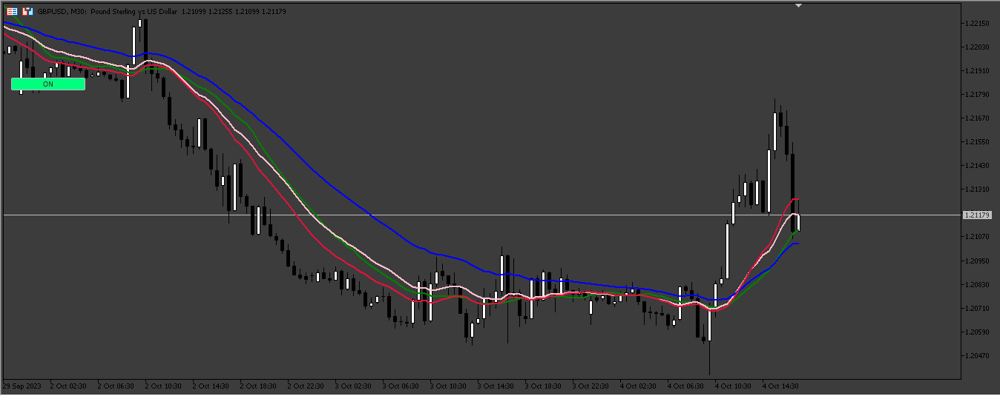

# Adaptative_Moving_Average

> Source: https://fxcodebase.com/code/viewtopic.php?f=38&t=74231  
> Forum: 38 · Topic 74231 · 3 post(s)

---

## Adaptative_Moving_Average

**Apprentice** · Sun Oct 08, 2023 4:25 am

Based on the request.
[https://fxcodebase.com/code/viewtopic.php?f=27&t=74102](https://fxcodebase.com/code/viewtopic.php?f=27&t=74102)

 [Adaptative_Moving_Average.mq5](files/152860/Adaptative_Moving_Average.mq5)

---

## Re: Adaptative_Moving_Average

**Bihb686** · Tue Oct 10, 2023 2:07 am

Can I send an EA and ask you to review it for me?

---

## Re: Adaptative_Moving_Average

**Apprentice** · Thu Oct 12, 2023 3:40 am

Sure, send me an email.
