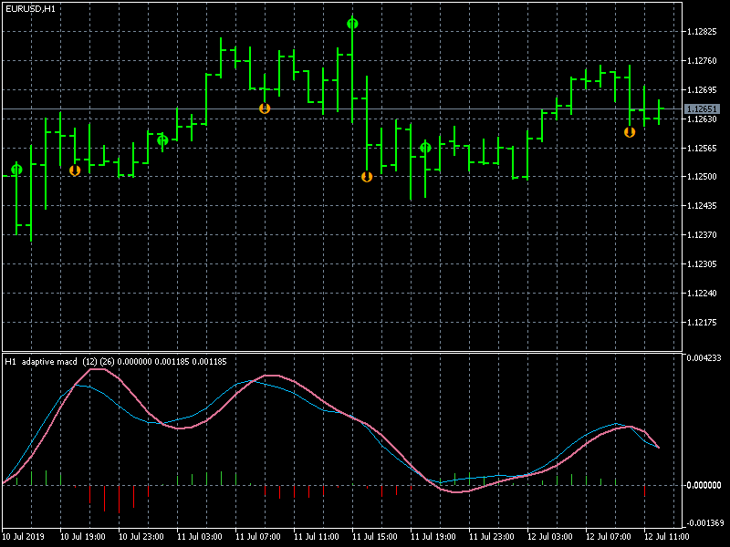

# adaptive_macd__mtf-alerts-arrows_nmc (MQ5)

> Source: https://fxcodebase.com/code/viewtopic.php?f=38&t=68655  
> Forum: 38 · Topic 68655 · 4 post(s)

---

## adaptive_macd__mtf-alerts-arrows_nmc (MQ5)

**Apprentice** · Fri Jul 12, 2019 6:08 am

Based on request.
[viewtopic.php?f=27&t=68638](https://fxcodebase.com/code/viewtopic.php?f=27&t=68638)

 [adaptive_macd__mtf-alerts-arrows_nmc.mq5](files/127313/adaptive_macd__mtf-alerts-arrows_nmc.mq5)

---

## Re: adaptive_macd__mtf-alerts-arrows_nmc (MQ5)

**Gilles** · Mon May 02, 2022 6:12 am

Hi Apprentice,
Please convert it to lua version.
Thank you very much :)

---

## Re: adaptive_macd__mtf-alerts-arrows_nmc (MQ5)

**Apprentice** · Mon May 02, 2022 8:49 am

We have added your request to the development list.
Development reference 273.

---

## Re: adaptive_macd__mtf-alerts-arrows_nmc (MQ5)

**Apprentice** · Tue May 31, 2022 7:07 am

Try MTF Averages MACD.lua
[https://fxcodebase.com/code/viewtopic.php?f=17&t=65111](https://fxcodebase.com/code/viewtopic.php?f=17&t=65111)
