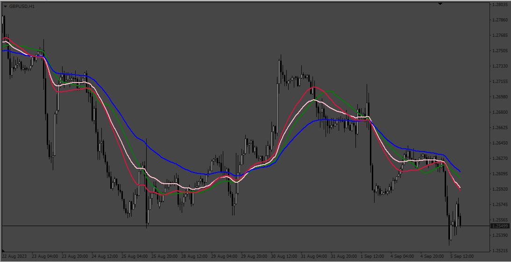
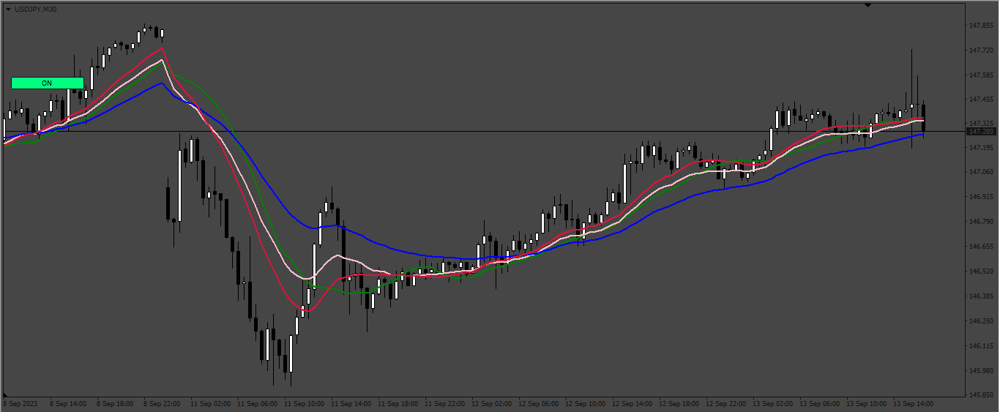

# Adaptive_Moving_Average

> Source: https://fxcodebase.com/code/viewtopic.php?f=38&t=74148  
> Forum: 38 · Topic 74148 · 2 post(s)

---

## Adaptive_Moving_Average

**Apprentice** · Mon Sep 11, 2023 6:19 am

Based on the request.
[https://fxcodebase.com/code/viewtopic.p ... 17#p152317](https://fxcodebase.com/code/viewtopic.php?f=27&p=152317#p152317)

 [Adaptive_Moving_Average.mq4](files/152511/Adaptive_Moving_Average.mq4)

---

## Re: Adaptive_Moving_Average

**Apprentice** · Sat Sep 16, 2023 4:16 am

 [Adaptive_Moving_Average On Off.mq4](files/152594/Adaptive_Moving_Average%20On%20Off.mq4)
