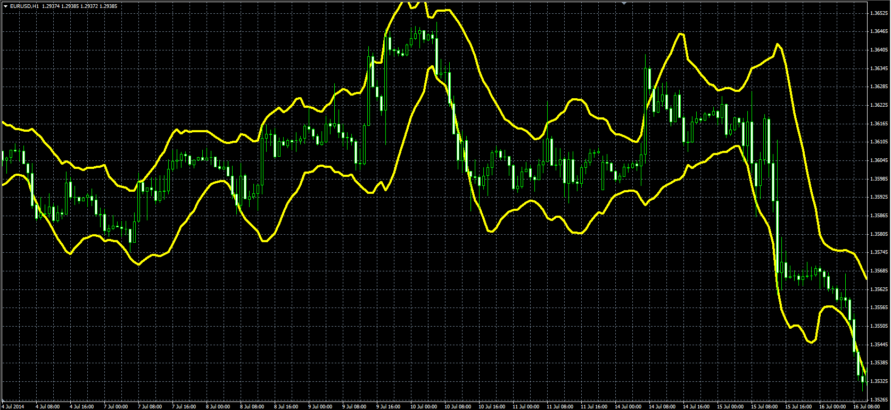

# Adaptive Price Zone

> Source: https://fxcodebase.com/code/viewtopic.php?f=38&t=61175  
> Forum: 38 · Topic 61175 · 1 post(s)

---

## Adaptive Price Zone

**Alexander.Gettinger** · Thu Sep 18, 2014 9:46 am

Original LUA indicator: [viewtopic.php?f=17&t=30266](https://fxcodebase.com/code/viewtopic.php?f=17&t=30266).

Formulas:
Up = MA1+width*MA2,
Dn = MA1-width*MA2, where
MA1 = MA(Price) with [Length] number of periods and [Method] type,
MA2 = MA(Range) with [Length] number of periods and [Method] type,
Range = High-Low.

 

Download:

 [APZ.mq4](files/95991/APZ.mq4)
