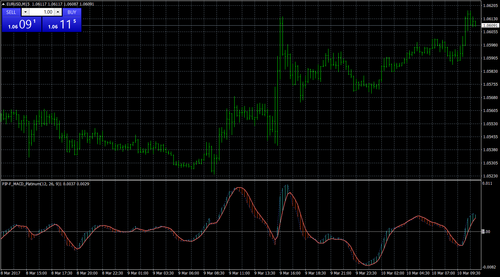

# Adding Push Notifications to MACD Platinum Indicator

> Source: https://fxcodebase.com/code/viewtopic.php?f=38&t=64514  
> Forum: 38 · Topic 64514 · 3 post(s)

---

## Adding Push Notifications to MACD Platinum Indicator

**Apprentice** · Fri Mar 10, 2017 6:03 am

The trader has now the option to get push notifications for the MACD Platinum signals. They can be turned on and off just as the rest of alert options.

Turning push notifications On:

- MT4 App is needed to be installed in an Android Phone or iPhone
- Inside the App, go to Settings, scroll down and write down the Metaquotes ID
- Now go to the MT4 options in your PC where you will be running the indicator providing the push notifications
- Select the Notifications Tab
- Check the Push Notifications and type the Metaquotes ID
- Click on Test to make sure it works

Push notifications are another type of alerts going outside MT4 same as the Email alerts. The difference is that they go to the phone notifications, similar to Whatsapp and Instagram push notifications. If your phone is Windows you might want to continue using email alerts.

 [MACD_Platinum.mq4](files/111387/MACD_Platinum.mq4)

---

## Re: Adding Push Notifications to MACD Platinum Indicator

**thirstydaniel** · Fri Mar 31, 2017 10:50 pm

Goodday sir , may i ask if it sends notification of Divergence please ? Thanks

---

## Re: Adding Push Notifications to MACD Platinum Indicator

**Apprentice** · Wed Apr 05, 2017 3:49 pm

Your request is added to the development list, Under Id Number 3773
 If someone is interested to do this task, please contact me.
