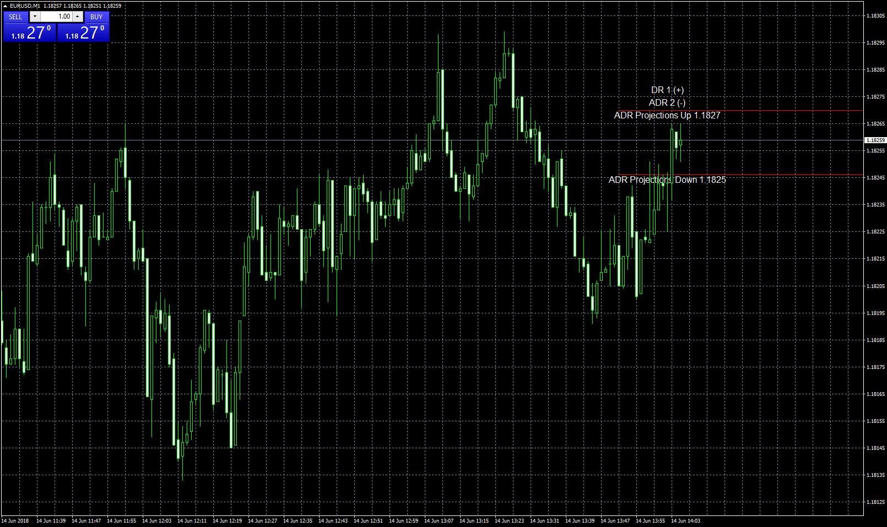

# ADR Projection

> Source: https://fxcodebase.com/code/viewtopic.php?f=38&t=66195  
> Forum: 38 · Topic 66195 · 19 post(s)

---

## ADR Projection

**Apprentice** · Thu Jun 14, 2018 8:05 am

Lua original
[viewtopic.php?f=17&t=2799](https://fxcodebase.com/code/viewtopic.php?f=17&t=2799)

 [ADR Projection.mq4](files/119576/ADR%20Projection.mq4)

 [MTF ADR Projection.mq4](files/119576/MTF%20ADR%20Projection.mq4)

---

## Re: ADR Projection

**ciclon** · Fri Jan 04, 2019 9:49 pm

Hi Apprentice, very good job with your ADR_Projection.mq4.
Do you have it for MT5 ???
Thanks in advance.....

---

## Re: ADR Projection

**Apprentice** · Sat Jan 05, 2019 5:23 am

Your request is added to the development list under Id Number 4406

---

## Re: ADR Projection

**Alexander.Gettinger** · Mon Jan 07, 2019 8:43 pm

Please try this MQL5 indicators:

 [ADR Projection.mq5](files/123258/ADR%20Projection.mq5)

 [MTF ADR Projection.mq5](files/123258/MTF%20ADR%20Projection.mq5)

---

## Re: ADR Projection

**ciclon** · Sun Jan 27, 2019 5:12 pm

Thank you very very much, Alexander.Gettinger,
Both indicators are fabulous !!!
Kind regards,

---

## Re: ADR Projection

**optionhk** · Fri Nov 13, 2020 10:49 am

> **Alexander.Gettinger wrote:**
> Please try this MQL5 indicators:
>
>
> ADR Projection.mq5
>
>
>
>
>
> MTF ADR Projection.mq5

Excellent classical indicators as can be expected from Alexander.Gettinger.

However, if you can provide the facility for coefficient or multipliers both for Upper Level and Lower level similar to the way you have provided for ATR projection, that will be excellent.

Thanks

---

## Re: ADR Projection

**Apprentice** · Sun Nov 15, 2020 3:52 am

Your request is added to the development list.
Development reference 2312.

---

## Re: ADR Projection

**Apprentice** · Sun Nov 22, 2020 5:55 pm

[ADR Projection.mq5](files/139075/ADR%20Projection.mq5)

Try this version.

---

## Re: ADR Projection

**optionhk** · Sat May 29, 2021 11:45 am

> **Apprentice wrote:**
>
>
> eurusd-m1-fxcm-australia-pty.png
>
>
> Lua original
> [viewtopic.php?f=17&t=2799](https://fxcodebase.com/code/viewtopic.php?f=17&t=2799)
>
>
> ADR Projection.mq4
>
>
>
>
> MTF ADR Projection.mq4

In addition to the existing data on the moving lines, can you please show Fibo levels displayed as well on the same lines, that would be great. BOth ADR values and Fibo ratios will help taking trading decisions. Thank you.

---

## Re: ADR Projection

**Apprentice** · Sun May 30, 2021 7:00 am

Your request is added to the development list.
Development reference 531.

---

## Re: ADR Projection

**Apprentice** · Thu Jun 03, 2021 2:00 pm

[ADR_Projection.mq4](files/142410/ADR_Projection.mq4)

 [ADR_Projection.mq5](files/142410/ADR_Projection.mq5)

---

## Re: ADR Projection

**optionhk** · Thu Aug 12, 2021 10:22 pm

Thank you very much.
Kindly put up MT5 version which can be used for futures trading.

---

## Re: ADR Projection

**Apprentice** · Fri Aug 13, 2021 7:58 am

Your request is added to the development list.
Development reference 743.

---

## Re: ADR Projection

**optionhk** · Sat Aug 14, 2021 11:34 pm

> **Apprentice wrote:**
>
>
> ADR_Projection.mq4
>
>
> Try this version.

It is working well.
1. I am a novice of coding. Can't even understand mql.
so excuse this 72 year old man for asking noob questions.

DR or daily range text appears along with ADR? How is DR calculated?

2. Can volumes be averaged like daily range formula and included in this MTF indicator to show
two horizontal bands of volumes along with Fibo values.

Thank you.

---

## Re: ADR Projection

**Apprentice** · Sun Aug 15, 2021 4:40 am

Your request is added to the development list.
Development reference 747.

---

## Re: ADR Projection

**Apprentice** · Thu Aug 19, 2021 12:45 pm

ADR_Projection.mq4 added.

---

## Re: ADR Projection

**optionhk** · Sat Aug 21, 2021 9:43 am

Thank you very much.

Now the last part of having a projection instead of using ADR or ATR to have Average Daily Volume (ADV) projected similarly as having two lines based on Average Daily Volume imprinted on the Fibo scale as is done now.

The ADR/ATR indicator will not be used when the average daily volume projection is used.
Maybe a separate indicator on the same format solely for average daily volume.
Or have an option to have it in the existing indicator. Whatever you think can be implemented.

In any case, a projection like this can be used for one indicator only. Please find attached an indicator that supplies daily average volumes data for 30 days as well as TF data on a dynamic moving line comparing volume for the current candle with the previous candle in % change.

---

## Re: ADR Projection

**Apprentice** · Tue Aug 24, 2021 3:15 am

1. DR is calculated as High-low
2. I don't understand understand what formula you need
As average od daily volume?

---

## Re: ADR Projection

**optionhk** · Tue Aug 24, 2021 10:03 am

Ok.

Can technically the Volume Average of 30 days be divided into half (50%) or a median line and linked with the Current open first tick volume as the first addition or subtraction Green (Plus to 50%) or Red (minus to -50) and projection of a dynamic band be developed on the lines of ADR/ATR projection.

Or use 30 day average volume as a grid with user defined xxxxx (example: 1000 volume as the grid marker divided into 8 horizontal grid above the open of the current tick volume and another 8 below . total 16 grid lines.

Fibo is optional for this indicator.
