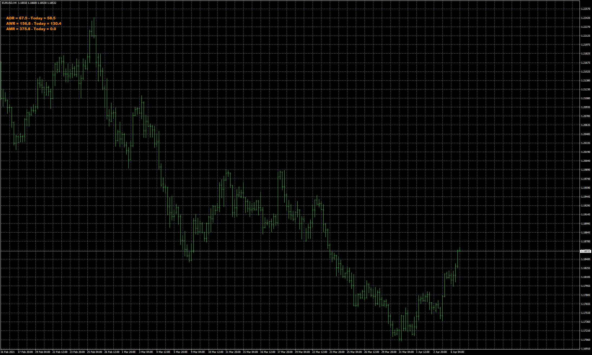

# ADR Thangaraj

> Source: https://fxcodebase.com/code/viewtopic.php?f=38&t=71362  
> Forum: 38 · Topic 71362 · 9 post(s)

---

## ADR Thangaraj

**Apprentice** · Thu Jul 22, 2021 10:09 am

 [ADR Thangaraj .mq4](files/142926/ADR%20Thangaraj%20.mq4)

 [ADR_Thangaraj.mq5](files/142926/ADR_Thangaraj.mq5)

---

## Re: ADR Thangaraj

**Thangaraj** · Thu Aug 05, 2021 1:00 am

Thank you so much for your Timely Help..! sir..! This is Exactly i Needed..! God Bless You..! And Your Journey..!

---

## Re: ADR Thangaraj

**Thangaraj** · Mon Aug 16, 2021 11:02 am

> **Apprentice wrote:**
>
>
> eurusd-h4-fxcm-australia-pty.png
>
>
>
>
> ADR Thangaraj .mq4

Greetings Sir,
Small Corrections Needed for this Indicator Sir, ( ADR Thangaraj )
Indicator Works Fine..!

Problem : When I Save Template With This Indicator Those Previous ADR Values Stayed There, Even After Removing The Indicator,
Normally i Install And Remove This Indicator Without Any Problem,
But when i save the indicator in any templates , those old values stayed there. and it super imposes with new ADR Values..!
Pls Solve this problem..!

Thank you so much..!

---

## Re: ADR Thangaraj

**Apprentice** · Tue Aug 17, 2021 4:38 am

Your request is added to the development list.
Development reference 751.

---

## Re: ADR Thangaraj

**Apprentice** · Mon Aug 23, 2021 12:57 am

ADR Thangaraj.mq4 Use custom indicator ID parameter.

 [ADR_Thangaraj.mq4](files/143309/ADR_Thangaraj.mq4)

---

## Re: ADR Thangaraj

**Thangaraj** · Sat Sep 04, 2021 10:28 am

> **Apprentice wrote:**
> ADR Thangaraj.mq4 Use custom indicator ID parameter.
>
>
> ADR_Thangaraj.mq4

Thank you so much sir, Works Great Problem Solved..!

---

## Re: ADR Thangaraj

**Thangaraj** · Sat Apr 29, 2023 10:22 pm

> **Apprentice wrote:**
> ADR Thangaraj.mq4 Use custom indicator ID parameter.
>
>
> ADR_Thangaraj.mq4

Greetings , Pls Convert This ADR Indicator For MT5 Version..!

It will Be Very Helpful For All of Us..!

---

## Re: ADR Thangaraj

**Apprentice** · Mon May 01, 2023 5:21 am

We have added your request to the development list.
Development reference 380.

---

## Re: ADR Thangaraj

**Apprentice** · Thu Jun 15, 2023 9:59 am

MT5 version added.
