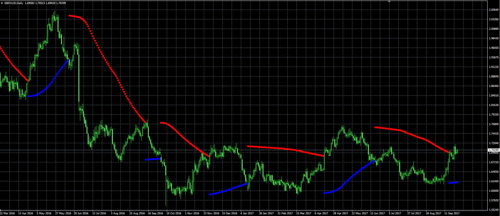

# Advance Parabolic Time/Price System

> Source: https://fxcodebase.com/code/viewtopic.php?f=38&t=65118  
> Forum: 38 · Topic 65118 · 1 post(s)

---

## Advance Parabolic Time/Price System

**Alexander.Gettinger** · Tue Sep 26, 2017 12:25 pm

Original LUA indicator: [viewtopic.php?f=17&t=60257](https://fxcodebase.com/code/viewtopic.php?f=17&t=60257)

 

Download:

 [ASAR.mq4](files/115102/ASAR.mq4)
