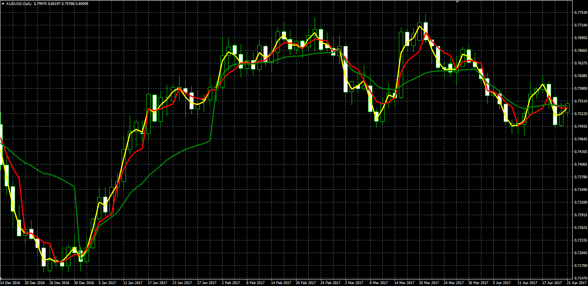

# Advance VWAP

> Source: https://fxcodebase.com/code/viewtopic.php?f=38&t=65662  
> Forum: 38 · Topic 65662 · 44 post(s)

---

## Advance VWAP

**Alexander.Gettinger** · Mon Jan 22, 2018 11:57 am

Original LUA indicator: [viewtopic.php?f=17&t=65661](https://fxcodebase.com/code/viewtopic.php?f=17&t=65661)

 

Download:

 [VWAP.mq4](files/117195/VWAP.mq4)

 [VWAP Oscillator.mq4](files/117195/VWAP%20Oscillator.mq4)

VWAP_Oscillator_normilized
[viewtopic.php?f=38&t=69640](https://fxcodebase.com/code/viewtopic.php?f=38&t=69640)

---

## Re: Advance VWAP

**nookie** · Sun Feb 04, 2018 7:24 am

Is it possible histogram output ?

---

## Re: Advance VWAP

**Apprentice** · Mon Feb 05, 2018 5:07 pm

histogram?
As Oscillator and central line as reference?

---

## Re: Advance VWAP

**nookie** · Tue Feb 06, 2018 5:16 am

Yes, exactly, sorry for the confusion.

---

## Re: Advance VWAP

**Apprentice** · Thu Feb 08, 2018 7:15 am

VWAP Oscillator.mq4 added.
I hope I understand your intent.

---

## Re: Vwap oscillator

**aladdin007** · Sat Aug 24, 2019 1:33 pm

Thank you so much for the indicator I would like to ask if you can make it work in smal time frame 5M,15,m and why not 1m if it’s possible
Thank you so much for your hard work

---

## Re: Vwap oscillator

**aladdin007** · Sat Aug 24, 2019 1:35 pm

I forget my request is about the vwap oscillator
Thank you again

---

## Re: Advance VWAP

**Apprentice** · Tue Aug 27, 2019 7:21 am

Your request is added to the development list.
 Internal developer reference 6.

---

## Re: Advance VWAP

**aladdin007** · Tue Aug 27, 2019 8:35 am

thank you so much MR apprentice and MR mario

---

## Re: Advance VWAP

**Apprentice** · Thu Aug 29, 2019 6:26 am

Daily, Weekly and Monthly added.

 [VWAP Oscillator.mq4](files/128284/VWAP%20Oscillator.mq4)

---

## Re: Advance VWAP

**aladdin007** · Fri Aug 30, 2019 8:15 am

Thank you so much for the help Mr apprentice and Mr Mario

---

## Re: Advance VWAP

**logicgate** · Sat Aug 31, 2019 8:57 am

I downloaded and noticed it is missing the other timeframes, wasn´t it supposed to have 5m, 15m, 30m, 1h, 4h and monthly?

---

## Re: Z distance from vwap

**aladdin007** · Sat Aug 31, 2019 10:42 am

Please can you make this indicator for mt4,please

---

## Re: Advance VWAP

**Apprentice** · Sun Sep 01, 2019 4:48 am

Can you provide web reference, code or detailed description?

---

## Re: Advance VWAP

**aladdin007** · Sun Sep 01, 2019 5:41 am

[https://www.tradingview.com/script/HraI ... -LazyBear/](https://www.tradingview.com/script/HraIjfKF-Z-distance-from-VWAP-LazyBear/)

All the information is in this link thank you so much MR apprentice

---

## Re: Advance VWAP

**aladdin007** · Mon Sep 02, 2019 5:15 am

> **Apprentice wrote:**
> Can you provide web reference, code or detailed description?

Mr apprentice do you think you can make it ?

---

## Re: Advance VWAP

**logicgate** · Mon Sep 02, 2019 10:14 am

Hi there dear friend Apprentice, please don´t forget the request on the post:

[viewtopic.php?p=128317#p128317](http://www.fxcodebase.com/code/viewtopic.php?p=128317#p128317)

I think it will be more useable if we could choose lower timeframes VWAPS for the lower timeframes, because daily and weekly on a 5m, 15m timeframe does not look good, I think that the 1H and 4H VWAPS would look better.

---

## Re: Advance VWAP

**aladdin007** · Mon Sep 02, 2019 7:56 pm

I would love to have vwap oscillator with all time frame as u said ,I think also zscore it’s good one
Thanks to all Mr Mario and Mr apprentice

---

## Re: Advance VWAP

**Apprentice** · Thu Sep 05, 2019 7:22 am

Try this version.
[viewtopic.php?f=17&t=68887](https://fxcodebase.com/code/viewtopic.php?f=17&t=68887)

---

## Re: Z distance from VWAP

**aladdin007** · Thu Sep 05, 2019 3:45 pm

o did ask for mt4 indicator MR apprentice
thank you for ur hard work

---

## Re: Advance VWAP

**durlovjagiroad** · Sun Dec 15, 2019 4:58 pm

Need vwap oscillator for 5 min 15m and 30m for mt4

---

## Re: Advance VWAP

**Apprentice** · Mon Dec 16, 2019 6:28 am

Your request is added to the development list.
Development reference 445.

---

## Re: Advance VWAP

**durlovjagiroad** · Thu Dec 19, 2019 3:28 pm

not working this new timeframe of m5 ...m30..

---

## Re: Advance VWAP

**Apprentice** · Mon Dec 23, 2019 5:52 am

[VWAP_Oscillator.mq4](files/130396/VWAP_Oscillator.mq4)

Fixed.

---

## Re: Advance VWAP

**durlovjagiroad** · Thu Mar 12, 2020 4:10 pm

Is it possible to keep the range of the oscillator between 0 and 100...i,e minimum 0 and maximum 100..?

---

## Re: Advance VWAP

**Apprentice** · Fri Mar 13, 2020 5:13 am

Your request is added to the development list.
Development reference 861.

---

## Re: Advance VWAP

**aladdin007** · Thu Mar 19, 2020 7:45 pm

Hi Mr Mario apprentice
I hope you doing great

Can you please add the option to chose the currency I want on Vwap oscillator
Like on the indicator ccfp

Thank you so much

---

## Re: Advance VWAP

**Apprentice** · Fri Mar 20, 2020 5:38 am

Your request is added to the development list.
Development reference 908.

---

## Re: Advance VWAP

**aladdin007** · Sun Mar 22, 2020 7:53 am

Mr Mario apprentice

I forgot if you can add the XAU to please

Thank you so much

---

## Re: Advance VWAP

**Apprentice** · Tue Mar 24, 2020 9:36 am

[VWAP_Other_Symbol_Oscillator.mq4](files/132241/VWAP_Other_Symbol_Oscillator.mq4)

Try this version.

---

## Re: Advance VWAP

**aladdin007** · Tue Mar 24, 2020 8:33 pm

Thank you so much
Mr Mario apprentice

---

## Re: Advance VWAP

**Apprentice** · Thu Apr 09, 2020 7:10 am

VWAP_Oscillator_normilized
[viewtopic.php?f=38&t=69640](https://fxcodebase.com/code/viewtopic.php?f=38&t=69640)

---

## Re: Advance VWAP

**amirhosein** · Fri Jan 29, 2021 9:36 am

hi mr Apprentice
vwap occillator is repainting
can u fix it ? thanks

---

## Re: Advance VWAP

**Apprentice** · Fri Jan 29, 2021 9:59 am

Not to be re-calculated for the current candle?

---

## Re: Advance VWAP

**amirhosein** · Fri Jan 29, 2021 10:40 am

> **Apprentice wrote:**
> Not to be re-calculated for the current candle?

i see some changes in value from the past in low time frames like 5 min

thanks man for your great services u provide for traders...

---

## Re: Advance VWAP

**amirhosein** · Tue Feb 02, 2021 1:06 pm

> **amirhosein wrote:**
>
>
> > **Apprentice wrote:**
> > Not to be re-calculated for the current candle?
>
>
>
> i see some changes in value from the past in low time frames like 5 min
>
> thanks man for your great services u provide for traders...

mr apprentice please answer, tell me if im wrong thank you..

---

## Re: Advance VWAP

**amirhosein** · Sun May 09, 2021 12:26 pm

> **Alexander.Gettinger wrote:**
> Original LUA indicator: [viewtopic.php?f=17&t=65661](https://fxcodebase.com/code/viewtopic.php?f=17&t=65661)
>
>
>
> VWAP_MQL.PNG
>
>
>
> Download:
>
>
> VWAP.mq4
>
>
>
>
> VWAP Oscillator.mq4
>
>
>
> VWAP_Oscillator_normilized
> [viewtopic.php?f=38&t=69640](https://fxcodebase.com/code/viewtopic.php?f=38&t=69640)

hello sir
can you add monthly calcalucation to the vwap_ocillator
thank you for your servis you provide for commiunity of traders

---

## Re: Advance VWAP

**Apprentice** · Tue May 11, 2021 3:25 am

Your request is added to the development list.
Development reference 465.

---

## Re: Advance VWAP

**Apprentice** · Wed May 12, 2021 5:32 am

[VWAP_Oscillator.mq4](files/142045/VWAP_Oscillator.mq4)

Try this version.

---

## Re: Advance VWAP

**krazii** · Tue Jan 25, 2022 10:42 am

Hi there, can you please add quarterly and yearly vwap to this?

---

## Re: Advance VWAP

**Apprentice** · Wed Jan 26, 2022 3:24 am

Your request is added to the development list.
Development reference 61.

---

## Re: Advance VWAP

**krazii** · Wed Jan 26, 2022 11:08 am

Thanks - for clarity, my last post was referring to the original vwap indicator posted in this thread (not the oscillator).

---

## Re: Advance VWAP

**krazii** · Mon Mar 07, 2022 12:33 pm

> **Apprentice wrote:**
> Your request is added to the development list.
> Development reference 61.

Hello, just wondering if this is progressing?

Thank you

---

## Re: Advance VWAP

**Apprentice** · Thu Jan 30, 2025 5:17 am

Task 61
Already completed in [viewtopic.php?f=38&t=65662](https://fxcodebase.com/code/viewtopic.php?f=38&t=65662)
