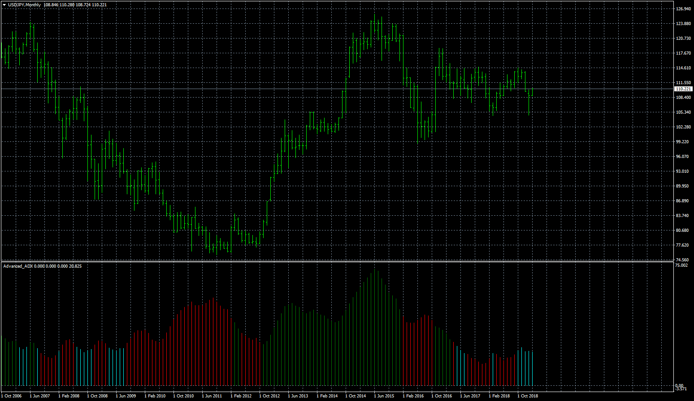

# Advanced_ADX

> Source: https://fxcodebase.com/code/viewtopic.php?f=38&t=67338  
> Forum: 38 · Topic 67338 · 3 post(s)

---

## Advanced_ADX

**Apprentice** · Mon Feb 11, 2019 6:04 am

Based on Advanced_ADX2.lua
[viewtopic.php?f=17&t=8966](https://fxcodebase.com/code/viewtopic.php?f=17&t=8966)

 [Advanced_ADX.mq4](files/123824/Advanced_ADX.mq4)

---

## Re: Advanced_ADX

**amazon1a** · Mon Feb 11, 2019 1:24 pm

Hi Apprentice, Thanks so much for this. A couple of things:

1. Can you change it slightly so that like in Advanced_ADX2 in TS2 I can detect as a distinct color those values below a certain level, in this case 20 to indicate more serious ADX Consolidation. For TS2 I use Dark blue below 20 and Light Blue between 20 and 32.

2. I am not able to use the level function in the indi on the Control Panel. I have to insert/draw a level by hand. Maybe there is a small glitch?

Many Thanks, AG

---

## Re: Advanced_ADX

**Apprentice** · Wed Feb 13, 2019 6:02 am

Try it now.
