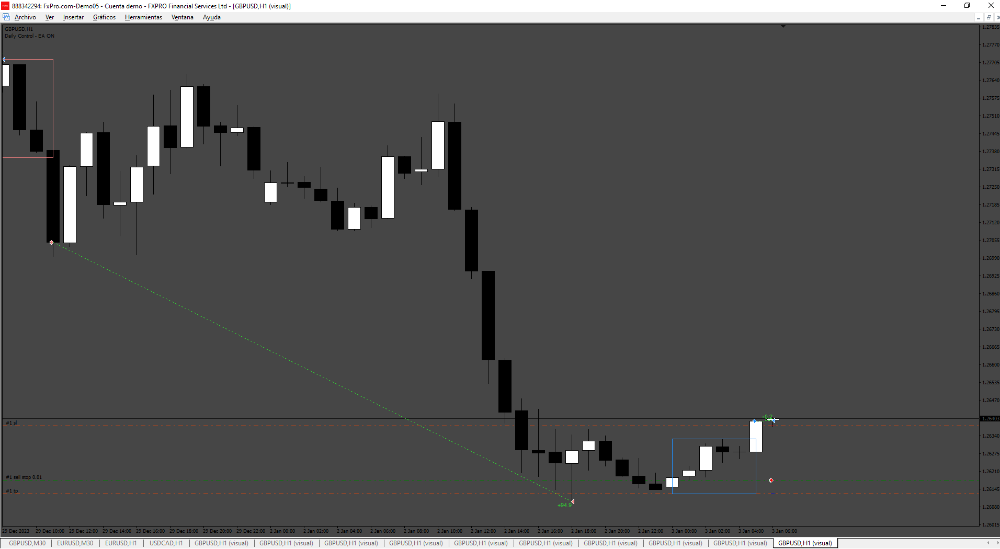
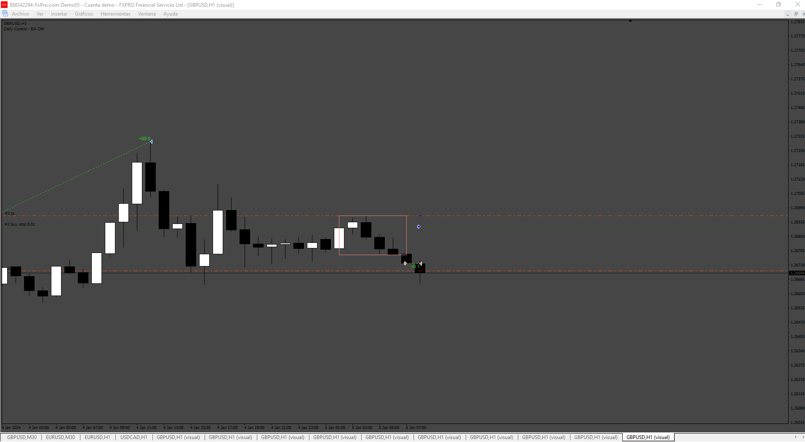
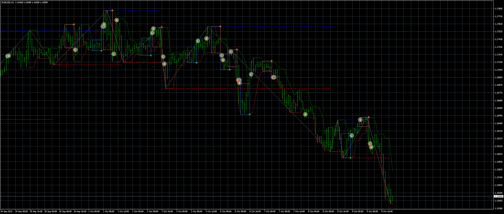

# Advanced_Breakeven EA

> Source: https://fxcodebase.com/code/viewtopic.php?f=38&t=75032  
> Forum: 38 · Topic 75032 · 8 post(s)

---

## Advanced_Breakeven EA

**Apprentice** · Fri Jul 05, 2024 3:52 am

 

Based on the request.
[https://fxcodebase.com/code/viewtopic.p ... 19#p155819](https://fxcodebase.com/code/viewtopic.php?f=27&p=155819#p155819)

 [Advanced_Breakeven EA.mq4](files/156010/Advanced_Breakeven%20EA.mq4)

---

## Re: Advanced_Breakeven EA

**Maximusrex70** · Mon Jul 08, 2024 5:34 am

Hi Admin thank you for the work you have done.
Errors encountered when opening pending orders.
See attached example.
I believe the indicator is not the correct one for my strategy, so I submit another modification to you, if you can use the attached indicator to open pending trades early.
Take profit on red or blue breakout line and pending order in advance based on defined pips,
thank you very much

---

## Re: Advanced_Breakeven EA

**Maximusrex70** · Mon Jul 08, 2024 5:35 am

New indicator insert in the EA, thanks

---

## Re: Advanced_Breakeven EA

**Maximusrex70** · Thu Jul 11, 2024 11:38 am

Hi Apprentice,
I don't know if I entered the topic correctly, so I'm writing to you again, I ask you please, if you can combine the "ZigZag breakout" indicator with the EA Advance Breakeven" as this indicator is much better than the one combined with the origin of the project ("Donchian Breakout System")
The take profit of the pending order must be on the red/sell or blue/buy line with the advance of the operations based on the pips set in the EA, everything else remains unchanged,
I see that you are very good and I'm sure you will succeed,
thank you very much

---

## Re: Advanced_Breakeven EA

**Apprentice** · Sat Jul 13, 2024 1:47 am

We have added your request to the development list.
Development reference 559

---

## Re: Advanced_Breakeven EA

**Maximusrex70** · Sat Jul 13, 2024 1:13 pm

hi, if it is possible I ask you to also add the “Trailing step n.” function. with the possibility of setting how many steps “1-2-3 etc. thanks

---

## Re: Advanced_Breakeven EA

**Maximusrex70** · Sun Aug 25, 2024 5:27 am

Hi Apprentice, do you have any news about development no. 559? Matching the Zigzag breakout indicator with the Advanced breakeven EA, thank you very much for your work

---

## Re: Advanced_Breakeven EA

**Apprentice** · Wed Oct 29, 2025 4:20 pm

 [ZigZag_breakout.ex4](files/161099/ZigZag_breakout.ex4)

 [Donchian.mq4](files/161099/Donchian.mq4)

 [Donchian_and_ZZ_Breakout_EA_v1.00.mq4](files/161099/Donchian_and_ZZ_Breakout_EA_v1.00.mq4)
