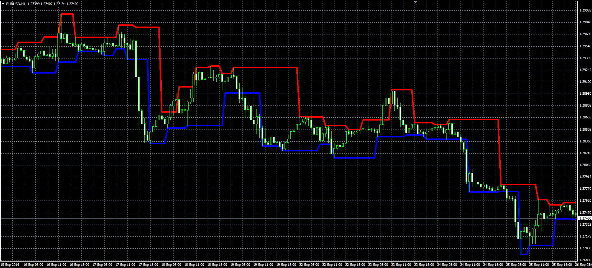

# Advanced fractal channel

> Source: https://fxcodebase.com/code/viewtopic.php?f=38&t=61451  
> Forum: 38 · Topic 61451 · 4 post(s)

---

## Advanced fractal channel

**Alexander.Gettinger** · Mon Nov 17, 2014 5:03 pm

The indicator draws a channel on fractals.

 

Download:

 [Fractal_Channel.mq4](files/97120/Fractal_Channel.mq4)

---

## Re: Advanced fractal channel

**briansummy** · Fri Sep 02, 2016 5:54 pm

How do I install this to MT4? I only remember Marketscope install.

---

## Re: Advanced fractal channel

**Apprentice** · Mon Sep 05, 2016 4:18 am

1. Open your MT4 platform.
2. Click on File
3. Click on Open Data Folder
4. Click on MQL4
5. Click indicators
Copy your indicator here.

---

## Re: Advanced fractal channel

**briansummy** · Mon Sep 05, 2016 12:00 pm

Thanks!
